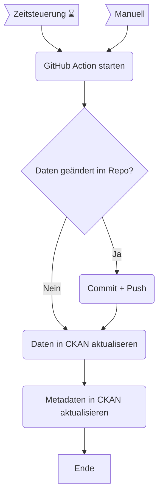

OGD Automation
==============

In diesem Verzeichnis ist der Code für zahlreiche Automationen, welche mit GitHub Actions gesteuert werden.
Die meisten Automationen dienen dazu, Datensätze auf dem Open-Data-Katalog zu aktualisieren.
Grundsätzlich werden keine neuen Datensätze durch diesen Code hier angelegt, sondern lediglich bestehende Datensätze aktualisiert.
D.h. bedeutet, dass initial ein neuer Datensatz manuell angelegt werden muss (entweder durch das CKAN Backend oder via API).


## GitHub Action

Eine GitHub Action wird durch eine YAML-Datei beschreiben, diese sind alle im Verzeichnis [`.github/workflows`](https://github.com/opendatazurich/opendatazurich.github.io/tree/master/.github/workflows) abgelegt.

GitHub hat eine [umfangreiche Dokumentation zu GitHub Actions](https://docs.github.com/de/actions) und wie diese Dateien aufgebaut sind.
In dieser Dokumentation werden lediglich die wichtigsten Punkte erklärt.



**Beispiel-YAML:**

```yaml
name: Update abstimmungsparolen data

on:
  schedule:
    - cron:  '15 14 * * *' # runs 14:15 UTC every day
  workflow_dispatch:
    inputs:
      force_update:
        description: 'Force update of resource and metadata'
        required: false
        default: 'false'

jobs:
  update_data_py:
    runs-on: ubuntu-latest
    timeout-minutes: 45
    environment: production
    strategy:
      matrix:
        python-version: [3.7]

    steps:
    - uses: actions/checkout@v3
    - name: Set up Python ${{ matrix.python-version }}
      uses: actions/setup-python@v4
      with:
        python-version: ${{ matrix.python-version }}
    - name: Install dependencies
      run: |
        python -m pip install --upgrade pip
        pip install -r automation/automation-requirements.txt
        sudo apt-get install sqlite3
        
    - name: Prepare data
      run: automation/abstimmungsparolen/run_scraper.sh
    
    - name: Upload artifact
      uses: actions/upload-artifact@v2
      with:
        name: abstimmungsparolen
        path: automation/abstimmungsparolen/abstimmungsparolen.csv
    
    - name: Check if there are changes in the repo
      run: |
        if git diff -w --no-ext-diff --quiet
        then
          echo '::set-output name=changed::0'
        else
          echo '::set-output name=changed::1'
        fi
      id: changes
        
    - name: Commit and push to repo
      if: steps.changes.outputs.changed == 1 # only try to commit if there are actually changes
      uses: github-actions-x/commit@v2.9
      with:
        github-token: ${{ secrets.GITHUB_TOKEN }}
        push-branch: master
        name: GitHub Action Bot
        email: opendata@zuerich.ch
        commit-message: Update abstimmungsparolen.csv with latest data
        rebase: 'true'

    - name: Upload file to CKAN
      if: ${{ steps.changes.outputs.changed == 1 || github.event.inputs.force_update != 'false' }}
      env:
        CKAN_BASE_URL: ${{ secrets.CKAN_BASE_URL }}
        CKAN_API_KEY: ${{ secrets.CKAN_API_KEY }}
        SSL_VERIFY: ${{ secrets.SSL_VERIFY }}
      run: |
        python automation/upload_resource_to_ckan.py -f automation/abstimmungsparolen/abstimmungsparolen.csv -d politik_abstimmungsparolen_gemeindeabstimmung_seit2012

    - name: Update CKAN metadata
      if: ${{ steps.changes.outputs.changed == 1 || github.event.inputs.force_update != 'false' }}
      env:
        CKAN_BASE_URL: ${{ secrets.CKAN_BASE_URL }}
        CKAN_API_KEY: ${{ secrets.CKAN_API_KEY }}
        SSL_VERIFY: ${{ secrets.SSL_VERIFY }}
      run: |
        python automation/xls_to_meta_xml.py -f automation/abstimmungsparolen/Meta_Abstimmungsparolen.xlsx --outfile automation/abstimmungsparolen/meta.xml
        python automation/update_metadata.py -d politik_abstimmungsparolen_gemeindeabstimmung_seit2012 -f automation/abstimmungsparolen/meta.xml

    - name: Notify telegram failure
      if: ${{ failure()  || cancelled() }}
      uses: appleboy/telegram-action@master
      with:
        to: ${{ secrets.TELEGRAM_ERROR_CHAT_ID }}
        token: ${{ secrets.TELEGRAM_TOKEN }}
        format: markdown
        message: |
          🔴 [SKZ Abstimmungsparolen Job Failed](https://github.com/opendatazurich/opendatazurich.github.io/actions/runs/${{ github.run_id }}?check_suite_focus=true)
```

### Secrets

Überall dort wo Passwörter, API-Keys, etc. verwendet werden, können die sogenannten Secrets verwendet werden.

Secrets sind ein Konzept von GitHub Actions, mit welchen sich nicht-öffentliche Informationen gespeichern lassen.
Die [Secrets sind in den Settings ersichtlich](https://github.com/opendatazurich/opendatazurich.github.io/settings/secrets/actions).

Es werden grundsätzlich zwei Arten von Secrets unterschieden: Repository Secrets und Environment Secrets.

***Repository Secrets:***


Diese sind in allen Workflows zugänglich über die Syntax `${{ secrets.name }}`, z.B. `${{ secrets.TELEGRAM_TOKEN }}`.

***Environment Secrets:***

.


