OGD Automation
==============

In diesem Verzeichnis ist der Code für zahlreiche Automationen, welche mit GitHub Actions gesteuert werden.
Die meisten Automationen dienen dazu, Datensätze auf dem Open-Data-Katalog zu aktualisieren.
Grundsätzlich werden keine neuen Datensätze durch diesen Code hier angelegt, sondern lediglich bestehende Datensätze aktualisiert.
D.h. bedeutet, dass initial ein neuer Datensatz manuell angelegt werden muss (entweder durch das CKAN Backend oder via API).

**Inhaltsverzeichnis:**

- [GitHub Action](#github-actions)
    * [Grundgerüst eines Workflows](#grundgerüst-eines-workflows)
    * [Secrets](#secrets)
    * [Artifakte](#artifakte)
    * [Dateien in Repository pushen](#dateien-in-repository-pushen)
    * [Daten in CKAN aktualiseren](#daten-in-ckan-aktualiseren)
    * [Metadaten in CKAN aktualisieren](#metadaten-in-ckan-aktualisieren)
- [Datensatz-Worflows](#einzelne-workflows)
    * [Abstimmungsparolen](#abstimmungsparolen)
    * [Hystreet Fussgängerfrequenzen](#hystreet-fussgängerfrequenzen)
    * [Museum Rietbert: Himmelheber](#museum-rietbert-himmelheber)
    * [Museum Rietberg: Patolu](#museum-rietberg-patolu)
    * [Stadtarchiv: Geschäftsberichte](#stadtarchiv-geschäftsberichte)
    * [Schulferien](#schulferien)
    * [Sonnenscheindauer](#sonnenscheindauer)
    * [Stimmbeteiligung](#stimmbeteiligung)
    * [WAPO Wetterstationen](#wapo-wetterstationen)
    * [VBZ Passagierfrequenz](#vbz-passagierfrequenz)
    * [Dateninventar OGD-Katalog](#dateninventar-ogd-katalog)
- [Hilfs-Worflows](#hilfs-workflows)
    * [Notifiy Datasets](#notify-datasets)
    * [Tagger](#tagger)
    * [DK-ÜL Export](#dk-ül-export)
    * [Metadaten-Excel Export](#metadaten-excel-export)
    * [Ressourcen sortieren](#ressourcen-sortieren)
    * [Showcases ohne Datasets](#showcases-ohne-datasets)


## GitHub Actions

Eine GitHub Action wird durch eine YAML-Datei beschreiben, diese sind alle im Verzeichnis [`.github/workflows`](https://github.com/opendatazurich/opendatazurich.github.io/tree/master/.github/workflows) abgelegt.

GitHub hat eine [umfangreiche Dokumentation zu GitHub Actions](https://docs.github.com/de/actions) und wie diese Dateien aufgebaut sind.
In dieser Dokumentation werden lediglich die wichtigsten Punkte erklärt.

```mermaid
flowchart TD
    Zeit>"Zeitsteuerung ⌛️"]
    Manuell>"Manuell"]
    Start(GitHub Action starten)
    Zeit --> Start
    Manuell --> Start
    Start --> Repo{Daten geändert im Repo?}
    Repo -->|Ja| Commit(Commit + Push)
    Repo -->|Nein| DataUpdate(Daten in CKAN aktualiseren)
    Commit --> DataUpdate
    DataUpdate --> MetadataUpdate(Metadaten in CKAN aktualisieren)
    MetadataUpdate --> Ende
```



**Beispiel-YAML:**

```yaml
name: Update abstimmungsparolen data

on:
  schedule:
    - cron:  '15 14 * * *' # runs 14:15 UTC every day
  workflow_dispatch:
    inputs:
      force_update:
        description: 'Force update of resource and metadata'
        required: false
        default: 'false'

jobs:
  update_data_py:
    runs-on: ubuntu-latest
    timeout-minutes: 45
    environment: production
    strategy:
      matrix:
        python-version: [3.7]

    steps:
    - uses: actions/checkout@v3
    - name: Set up Python ${{ matrix.python-version }}
      uses: actions/setup-python@v4
      with:
        python-version: ${{ matrix.python-version }}
    - name: Install dependencies
      run: |
        python -m pip install --upgrade pip
        pip install -r automation/automation-requirements.txt
        sudo apt-get install sqlite3
        
    - name: Prepare data
      run: automation/abstimmungsparolen/run_scraper.sh
    
    - name: Upload artifact
      uses: actions/upload-artifact@v2
      with:
        name: abstimmungsparolen
        path: automation/abstimmungsparolen/abstimmungsparolen.csv
    
    - name: Check if there are changes in the repo
      run: |
        if git diff -w --no-ext-diff --quiet
        then
          echo '::set-output name=changed::0'
        else
          echo '::set-output name=changed::1'
        fi
      id: changes
        
    - name: Commit and push to repo
      if: steps.changes.outputs.changed == 1 # only try to commit if there are actually changes
      uses: github-actions-x/commit@v2.9
      with:
        github-token: ${{ secrets.GITHUB_TOKEN }}
        push-branch: master
        name: GitHub Action Bot
        email: opendata@zuerich.ch
        commit-message: Update abstimmungsparolen.csv with latest data
        rebase: 'true'

    - name: Upload file to CKAN
      if: ${{ steps.changes.outputs.changed == 1 || github.event.inputs.force_update != 'false' }}
      env:
        CKAN_BASE_URL: ${{ secrets.CKAN_BASE_URL }}
        CKAN_API_KEY: ${{ secrets.CKAN_API_KEY }}
        SSL_VERIFY: ${{ secrets.SSL_VERIFY }}
      run: |
        python automation/upload_resource_to_ckan.py -f automation/abstimmungsparolen/abstimmungsparolen.csv -d politik_abstimmungsparolen_gemeindeabstimmung_seit2012

    - name: Update CKAN metadata
      if: ${{ steps.changes.outputs.changed == 1 || github.event.inputs.force_update != 'false' }}
      env:
        CKAN_BASE_URL: ${{ secrets.CKAN_BASE_URL }}
        CKAN_API_KEY: ${{ secrets.CKAN_API_KEY }}
        SSL_VERIFY: ${{ secrets.SSL_VERIFY }}
      run: |
        python automation/xls_to_meta_xml.py -f automation/abstimmungsparolen/Meta_Abstimmungsparolen.xlsx --outfile automation/abstimmungsparolen/meta.xml
        python automation/update_metadata.py -d politik_abstimmungsparolen_gemeindeabstimmung_seit2012 -f automation/abstimmungsparolen/meta.xml

    - name: Notify telegram failure
      if: ${{ failure()  || cancelled() }}
      uses: appleboy/telegram-action@master
      with:
        to: ${{ secrets.TELEGRAM_ERROR_CHAT_ID }}
        token: ${{ secrets.TELEGRAM_TOKEN }}
        format: markdown
        message: |
          🔴 [SKZ Abstimmungsparolen Job Failed](https://github.com/opendatazurich/opendatazurich.github.io/actions/runs/${{ github.run_id }}?check_suite_focus=true)
```

### Grundgerüst eines Workflows

Grundsätzlich besteht ein Workflow aus 1-n Jobs, und ein Job aus 1-n Steps (Einzelschritten).

Grundgerüst:

```yaml
name: Update my_dataset                    # Name des Workflows

on:                                        # Trigger für den Workflow
  schedule:                                # Zeitgesteuerter Trigger mit Cron-Syntax
    - cron:  '15 14 * * *'          
  workflow_dispatch:                       # Manueller Trigger für Workflows

jobs:
  update_data_py:
    runs-on: ubuntu-latest
    timeout-minutes: 45
    environment: production                # Umgebung, wichtig um die richtigen Environment Secrets zu laden (siehe unten)

    steps:
    - uses: actions/checkout@v3            # Repository klonen
    - name: Set up Python 3.8              # Python 3.8 installieren
      uses: actions/setup-python@v4
      with:
        python-version: 3.8
    - name: Install dependencies           # Abhängigkeiten installieren (Software-Pakete, Python Packages)
      run: |
        python -m pip install --upgrade pip
        pip install -r automation/automation-requirements.txt
        sudo apt-get install sqlite3
```


### Secrets

Überall dort wo Passwörter, API-Keys, etc. verwendet werden, können die sogenannten Secrets verwendet werden.

Secrets sind ein Konzept von GitHub Actions, mit welchen sich nicht-öffentliche Informationen gespeichern lassen.
Die [Secrets sind in den Settings ersichtlich](https://github.com/opendatazurich/opendatazurich.github.io/settings/secrets/actions).

Es werden grundsätzlich zwei Arten von Secrets unterschieden: Repository Secrets und Environment Secrets.

***Repository Secrets:***


Diese sind in allen Workflows zugänglich über die Syntax `${{ secrets.name }}`, z.B. `${{ secrets.TELEGRAM_TOKEN }}`.

***Environment Secrets:***

.

Je nach Environment werden andere Secrets geladen, das jeweilige Environment kann im Job angegeben werden z.B. `environment: production`.
Dies wird v.a. verwendet um CKAN INTEG und CKAN PROD zu unterscheiden.

### Artifakte

GitHub Action erlaubt es sogenannte Artifakte zu speichern, das sind Dateien, die während des Workflow-Runs erzeugt werden.
Wenn diese als Artifakte bereitgestellt werden, können diese für ca. 90 Tage heruntergeladen werden.
Das kann sinnvoll sein, um besser Debuggen zu können (z.B. für ein Logfile) oder um Daten von einem Job zu einem nächsten zu übertragen.

```yaml
- name: Upload artifact
  uses: actions/upload-artifact@v2
  with:
    name: abstimmungsparolen
    path: automation/abstimmungsparolen/abstimmungsparolen.csv
```

### Dateien in Repository pushen

Einige Workflow pflegen die Daten direkt im Repository, wenn also eine Datei verändert wurde, muss die Änderung wiederum als Commit in das Repository gepusht werden.

```yaml
- name: Check if there are changes in the repo
  run: |
    if git diff -w --no-ext-diff --quiet
    then
      echo '::set-output name=changed::0'
    else
      echo '::set-output name=changed::1'
    fi
  id: changes
        
- name: Commit and push to repo
  if: steps.changes.outputs.changed == 1 # only try to commit if there are actually changes
  uses: github-actions-x/commit@v2.9
  with:
    github-token: ${{ secrets.GITHUB_TOKEN }}
    push-branch: master
    name: GitHub Action Bot
    email: opendata@zuerich.ch
    commit-message: Update abstimmungsparolen.csv with latest data
    rebase: 'true'
```

In diesen Fällen lohnt es sich noch einen Schritt einzubauen, der prüft, ob es überhaupt eine Änderung im Repository gegeben hat.
Falls dieser der Fall ist wird eine Variable `changed` auf `1` gesetzt.

Die Action, die einen Commit macht, kann dann nur dann ausgeführt werden, wenn auch tatsächlich eine Änderung vorliegt (`if: steps.changes.outputs.changed == 1`).
Der Commit wird mit dem Benutzer "GitHub Action Bot" und der Email Adresse "opendata@zuerich.ch" durchgeführt.

### Daten in CKAN aktualiseren

Für den File-Upload wird das Skript [`upload_resource_to_ckan.py`](https://github.com/opendatazurich/opendatazurich.github.io/blob/master/automation/upload_resource_to_ckan.py) verwendet.
Es kann eine Datei und ein Dataset-Slug angegeben werden, die angegebene Datei wird dann hochgeladen.
Sollte es bereits eine Datei mit diesem Namen als Ressource auf dem Dataset geben, so wird diese Datei aktualisiert.
Andernfalls wird eine neue Ressource hinzugefügt.

```yaml
- name: Upload file to CKAN
  if: ${{ steps.changes.outputs.changed == 1 || github.event.inputs.force_update != 'false' }}
  env:
    CKAN_BASE_URL: ${{ secrets.CKAN_BASE_URL }}
    CKAN_API_KEY: ${{ secrets.CKAN_API_KEY }}
    SSL_VERIFY: ${{ secrets.SSL_VERIFY }}
  run: |
    python automation/upload_resource_to_ckan.py -f automation/abstimmungsparolen/abstimmungsparolen.csv -d politik_abstimmungsparolen_gemeindeabstimmung_seit2012
```
__UPDATE__: Im Skript [`upload_resource_to_ckan.py`](https://github.com/opendatazurich/opendatazurich.github.io/blob/master/automation/upload_resource_to_ckan.py) verwendet, beim Update einer Resource die CKAN API Funktion ```ckan.action.resource_update```. Wie auf der CKAN API Dokumentation vermerkt, ist es sicherer, die Funktion ```ckan.action.resource_patch``` zu verwenden ('Update methods may delete parameters not explicitly provided in the data_dict. If you want to edit only a specific attribute use resource_patch instead.'). Dafür kann das geannte Skript einfach mit folgendem ersetzt werden: [`upload_resource_to_ckan.py_with_patch`](https://github.com/opendatazurich/opendatazurich.github.io/blob/master/automation/upload_resource_to_ckan_with_patch.py). Zukünftig macht es Sinn, in allen Pipelines diese Skripte entsprechend auszutauschen.

### Metadaten in CKAN aktualisieren

Um die Metadaten zu aktualisieren, werden diese vom OGD-Metadaten-Excel extrahiert und auf CKAN hochgeladen.
Dazu sind zwei Skripte im Einsatz:

- [`xls_to_meta_xml.py`](https://github.com/opendatazurich/opendatazurich.github.io/blob/master/automation/xls_to_meta_xml.py): Skript das aus einem OGD-Metadaten-Excel ein `meta.xml` generiert
- [`update_metadata.py`](https://github.com/opendatazurich/opendatazurich.github.io/blob/master/automation/update_metadata.py): Aktualisierung von Metadaten auf CKAN basierend auf dem `meta.xml`

Alle Datensätze, die via GitHub Action aktualisiert werden, haben ein OGD-Metadaten-Excel im zugehörigen Ordner. Aus diesem wird das `meta.xml` generiert und anschliessend die Metadaten auf CKAN aktualisiert.

```yaml
- name: Update CKAN metadata
  if: ${{ steps.changes.outputs.changed == 1 || github.event.inputs.force_update != 'false' }}
  env:
    CKAN_BASE_URL: ${{ secrets.CKAN_BASE_URL }}
    CKAN_API_KEY: ${{ secrets.CKAN_API_KEY }}
    SSL_VERIFY: ${{ secrets.SSL_VERIFY }}
  run: |
    python automation/xls_to_meta_xml.py -f automation/abstimmungsparolen/Meta_Abstimmungsparolen.xlsx --outfile automation/abstimmungsparolen/meta.xml
    python automation/update_metadata.py -d politik_abstimmungsparolen_gemeindeabstimmung_seit2012 -f automation/abstimmungsparolen/meta.xml
```

## Einzelne Workflows

Jeder Workflow ist in seinem Ordner im jeweiligen README beschrieben.

### Abstimmungsparolen

=> [abstimmungsparolen/README.md](https://github.com/opendatazurich/opendatazurich.github.io/blob/master/automation/abstimmungsparolen/README.md)

### Hystreet Fussgängerfrequenzen

=> [hystreet_fussgaengerfrequenzen/README.md](https://github.com/opendatazurich/opendatazurich.github.io/blob/master/automation/hystreet_fussgaengerfrequenzen/README.md)

### Museum Rietbert: Himmelheber

=> [mrz_himmelheber/README.md](https://github.com/opendatazurich/opendatazurich.github.io/blob/master/automation/mrz_himmelheber/README.md)

### Museum Rietberg: Patolu

=> [mrz_patolu/README.md](https://github.com/opendatazurich/opendatazurich.github.io/blob/master/automation/mrz_patolu/README.md)

### Stadtarchiv: Geschäftsberichte

=> [sar_geschaeftsberichte/README.md](https://github.com/opendatazurich/opendatazurich.github.io/blob/master/automation/sar_geschaeftsberichte/README.md)

### Schulferien

=> [schulferien/README.md](https://github.com/opendatazurich/opendatazurich.github.io/blob/master/automation/schulferien/README.md)

### Sonnenscheindauer

Nicht produktiv, Test-Scraper für die Sonnenscheindauer.

=> [sonnenscheindauer/README.md](https://github.com/opendatazurich/opendatazurich.github.io/blob/master/automation/sonnenscheindauer/README.md)

### Stimmbeteiligung

=> [stimmbeteiligung/README.md](https://github.com/opendatazurich/opendatazurich.github.io/blob/master/automation/stimmbeteiligung/README.md)

### VBZ Passagierfrequenz

=> [vbz_frequenzen_hardbruecke/README.md](https://github.com/opendatazurich/opendatazurich.github.io/blob/master/automation/vbz_frequenzen_hardbruecke/README.md)

### WAPO Wetterstationen

=> [wapo_wetterstationen/README.md](https://github.com/opendatazurich/opendatazurich.github.io/blob/master/automation/wapo_wetterstationen/README.md)

### Dateninventar OGD-Katalog

=> [ogd_metadata/README.md](https://github.com/opendatazurich/opendatazurich.github.io/blob/master/automation/ogd_metadata/README.md)


## Hilfs-Workflows

Neben den Datensatz-Workflows gibt es auch noch einige Hilfs-Workflows, die bei der täglichen Arbeit unterstützen.

### Notify Datasets

Dieser [Workflow](https://github.com/opendatazurich/opendatazurich.github.io/actions/workflows/notify_datasets.yml) (mehr Infos im [README](https://github.com/opendatazurich/opendatazurich.github.io/blob/master/automation/notify_datasets/README.md)) sendet jeden Morgen automatisch eine Nachricht in einen definierten Telegram-Kanale mit den Informationen über die neuen oder geänderten Datensätze für jeden Harvester.
Es dient als eine Kontrolle, ob die Harvester korrekt laufen.

### Tagger

Der [Tagger](https://github.com/opendatazurich/opendatazurich.github.io/blob/master/automation/tagger/README.md) ist ein kleines Tool, das basierend auf einer YAML-Konfiguration Tags an Datensätzen anbringen kann.
Der zugehörige [Workflow](https://github.com/opendatazurich/opendatazurich.github.io/actions/workflows/tagger.yml) läuft alle 15min.

### DK-ÜL Export

Dieser [Workflow](https://github.com/opendatazurich/opendatazurich.github.io/actions/workflows/dk-uel.yml) kann manuell getriggert werden. Er lädt die CKAN-Metadaten in CSVs, welche sich in den DK-ÜL importieren lassen (durch Danny oder Michel).

### Metadaten-Excel Export

Mit diesem [Workflow](https://github.com/opendatazurich/opendatazurich.github.io/actions/workflows/export.yml) kann von einem Datensatz ein OGD-Metadaten-Excel generiert werden basierend auf den Metadaten, die auf CKAN eingetragen sind.
Das ist sinnvoll, falls das zugehörige Excel verloren ging oder manuelle Änderungen vorgenommen wurden.

### Ressourcen sortieren

[Workflow](https://github.com/opendatazurich/opendatazurich.github.io/actions/workflows/reorder-resources.yml) um die Sortierung von Ressourcen zu korrigieren.

Basiert auf einem Skript aus dem [metaodi/ckan-admin-scripts Repository](https://github.com/metaodi/ckan-admin-scripts).

### Showcases ohne Datasets

[Workflow](https://github.com/opendatazurich/opendatazurich.github.io/actions/workflows/showcases.yml) um CKAN Showcases aufzulisten, die zu keinem Datensatz verbunden sind.

Basiert auf einem Skript aus dem [metaodi/ckan-admin-scripts Repository](https://github.com/metaodi/ckan-admin-scripts).
