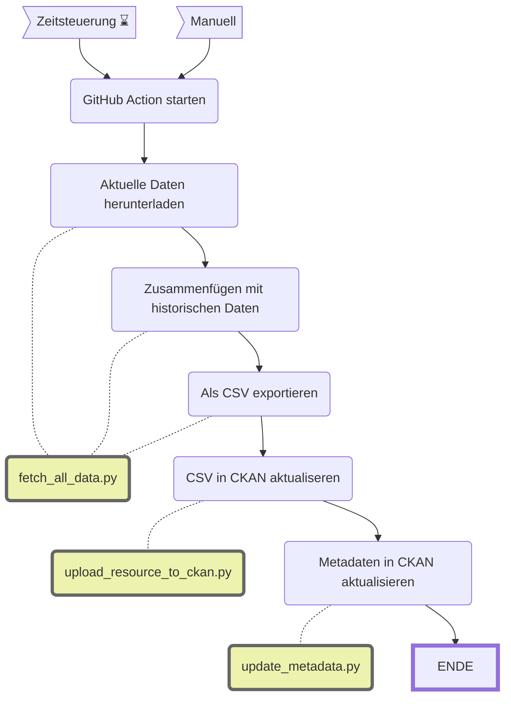

Abstimmungsresultate
==============================================

||Beschreibung|
|---|---|
|**Status:**||
|**Workflow:**|[`update_abstimmungsparolen.yml`](https://github.com/opendatazurich/opendatazurich.github.io/blob/master/.github/workflows/update_abstimmungsergebnisse.yml)|
|**Quelle:**| Daten vor 2022: Abstimmungsdatenbank von Statistik Stadt Zürich / Daten ab 2022: API von opendata.swiss|
|**Datensatz INT:**|[Abstimmungsresultate der Stadt Zürich, seit 1933 (data.integ.stadt-zuerich.ch)](https://data.integ.stadt-zuerich.ch/dataset/politik_abstimmungen_seit1933)|
|**Datensatz PROD:**|[Abstimmungsresultate der Stadt Zürich, seit 1933 (data.stadt-zuerich.ch)](https://data.stadt-zuerich.ch/dataset/politik_abstimmungen_seit1933)|

Die historischen Daten (bis 2022) stammen aus der Abstimmungsdatenbank von Statistik Stadt Zürich. Die aktuellen Daten (ab 2022) werden über eine API von opendata.swiss bezogen:
- [eidgenössische Vorlagen](https://ckan.opendata.swiss/api/3/action/package_show?id=echtzeitdaten-am-abstimmungstag-zu-eidgenoessischen-abstimmungsvorlagen) 
- [kantonale Vorlagen](https://ckan.opendata.swiss/api/3/action/package_show?id=echtzeitdaten-am-abstimmungstag-zu-kantonalen-abstimmungsvorlagen)
- [kommunale Vorlagen](https://ckan.opendata.swiss/api/3/action/package_show?id=echtzeitdaten-am-abstimmungstag-des-kantons-zurich-kommunale-und-regionale-vorlagen)

Das Skript [fetch_all_data.py](https://github.com/opendatazurich/opendatazurich.github.io/blob/master/automation/abstimmungsergebnisse/fetch_all_data.py) erstellt eine csv-Datei, die dann auf CKAN geladen wird.

