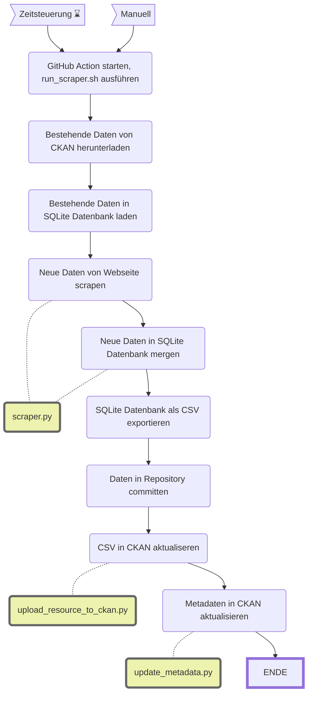

Abstimmungsparolen der Parteien im Gemeinderat
==============================================

||Beschreibung|
|---|---|
|**Status:**||
|**Workflow:**|[`update_abstimmungsparolen.yml`](https://github.com/opendatazurich/opendatazurich.github.io/blob/master/.github/workflows/update_abstimmungsparolen.yml)|
|**Quelle:**| [Parolen-Schnittstelle vom Statistischen Amt des Kantons Zürich](https://app.statistik.zh.ch/wahlen_abstimmungen/prod/Actual)
|**Datensatz INT:**|[Stimmbeteiligung in Prozent vor Urnengängen (data.integ.stadt-zuerich.ch)](https://data.integ.stadt-zuerich.ch/dataset/politik_stimmbeteiligung-vor-urnengangen)|
|**Datensatz PROD:**|[Stimmbeteiligung in Prozent vor Urnengängen (data.stadt-zuerich.ch)](https://data.stadt-zuerich.ch/dataset/politik_stimmbeteiligung-vor-urnengangen)|

Die Daten werden von der [Parolen-Schnittstelle vom Statistischen Amt des Kantons Zürich](https://app.statistik.zh.ch/wahlen_abstimmungen/prod/Actual) bezogen basierend auf den [Abstimmungsterminen von der Bundeskanzlei](https://www.bk.admin.ch/ch/d/pore/va/vab_1_3_3_1.html).

Die Skripte werden alle in [`run_scraper.sh`](https://github.com/opendatazurich/opendatazurich.github.io/blob/master/automation/abstimmungsparolen/run_scraper.sh) und schlussendlich das erstellte CSV im Repository und in CKAN hochgeladen.

