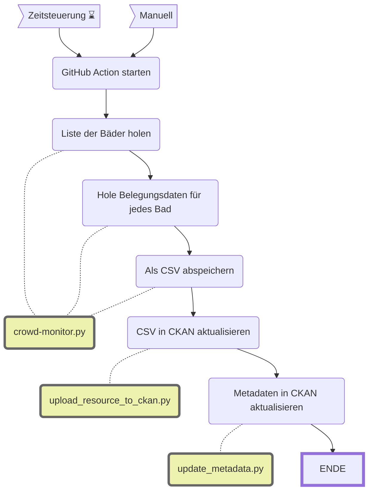

Update Badi Aktuell (Crowd Monitor)
====================

|                           | Beschreibung                                                                                                                                                                                                                                                           |
| ------------------------- | ---------------------------------------------------------------------------------------------------------------------------------------------------------------------------------------------------------------------------------------------------------------------- |
| **Status:**         |  |
| **Workflow:**       | [`update_badi_aktuell.yml`](https://github.com/opendatazurich/opendatazurich.github.io/blob/master/.github/workflows/update_badi_aktuell.yml)                                                                                                            |
| **Quelle:**         | [ASE Diamond API](https://zuerich.pas.ch/)                                                                                                                                                               |
| **Datensatz INT:**  | [Aktuelle Anzahl Badegäste (data.integ.stadt-zuerich.ch)](https://data.integ.stadt-zuerich.ch/dataset/ssd_spo_badi_aktuell)                                                                                                              |
| **Datensatz PROD:** | [Aktuelle Anzahl Badegäste (data.stadt-zuerich.ch)](https://data.stadt-zuerich.ch/dataset/ssd_spo_badi_aktuell)                                                                                                                          |

Dieser Workflow lädt Daten von der [Crowd Monitor API](https://premises.crowdmonitor.ch). Der Datensatz enthält die Anzahl der Gäste, die aktuell im jeweiligen Bad sind. Die Zahlen entsprechen denen, die auch bei [Badi aktuell](https://www.stadt-zuerich.ch/badi-aktuell) veröffentlicht werden.

Die API enthält auch einige Locations, die keine Bäder sind. Deswegen werden sie entfernt. Im Moment sind das: `locations_to_drop = ["Letzigrund", "Josel-Areal", "Messehalle 9"]`

Ausserdem gibt es einige Datensätze, wo die Maximale Kapazität = 0 ist. Diese werden ebenfalls entfernt.

