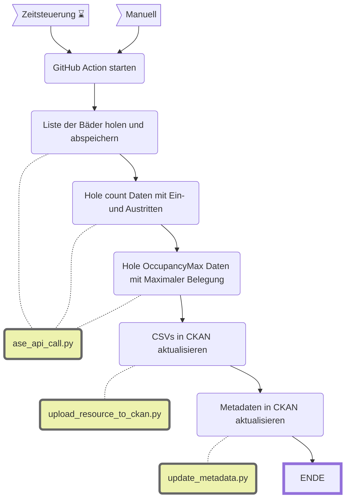

Badi Besuch (ASE)
====================

|                           | Beschreibung                                                                                                                                                                                                                                                           |
| ------------------------- | ---------------------------------------------------------------------------------------------------------------------------------------------------------------------------------------------------------------------------------------------------------------------- |
| **Status:**         |  |
| **Workflow:**       | [`update_badi_besuch.yml`](https://github.com/opendatazurich/opendatazurich.github.io/blob/master/.github/workflows/update_badi_besuch.yml)                                                                                                            |
| **Quelle:**         | [ASE Diamond API](https://zuerich.pas.ch/)                                                                                                                                                               |
| **Datensatz INT:**  | [Badi Besuchende (data.integ.stadt-zuerich.ch)](https://data.integ.stadt-zuerich.ch/dataset/ssd_spo_badi_besuch)                                                                                                              |
| **Datensatz PROD:** | [Badi Besuchende (data.stadt-zuerich.ch)](https://data.stadt-zuerich.ch/dataset/ssd_spo_badi_besuch)                                                                                                                          |

Dieser Workflow lädt Daten von der [ASE Diamond API](https://zuerich.pas.ch/). Details zur Schnittstelle finden sich hier: https://zuerich.pas.ch/v2/swagger/index.html

Das Skript [**`ase_api_call.py`**](ase_api_call.py) steuert den gesamten Ablauf:
- Authentifizierung
- Die infrage kommenden Bäder werden über den Endpoint `Location` geholt, bereinigt und als CSV abgelegt.
- Für jede Location werden Daten der Endpoints `count` (Ein- und Austritte) und `OccupancyMax` (Maximale Belegung) geholt und in einer Tabelle kombiniert
- Die Daten werden als CSV exportiert

Über [**`ase_parameters.py`**](ase_parameters.py) können verschiedene Einstellungen gemacht werden. Hier werden die wichtigsten erklärt:
- `LOCAL_EXECUTION`: Damit die Ausführung lokal auf den Rechnern von SSZ funktioniert, muss ein Proxy verwendet werden und die Requests können nicht verfiziert werden. Lokal sollte also `True` verwendet werden, sonst `False`.
- `GRANULARITY_TO_USE`: Legt fest, in welcher Granularität die Daten abgefragt werden. Mit dem Sportamt abgestimmt sind `FiveMinutes`. Das heisst die Daten werden in Fünf-Minuten-Abschnitten Gruppiert. Von der Granularität hängt auch ab, wie viele Daten aus der Vergangenheit man beziehen kann (siehe dazu `GRANULARITY_RANGE`).
- `VALID_LOCATIONS`: Es sollen nicht alle Locations verwendet werden (einige davon sind keine Bäder). Das ist die Liste der erwünschten Bäder
- `SUFFIX_TO_REMOVE`: Einige Bäder haben einen Suffix: " (Bis Mai 2026)". Das Sportamt ist sich nicht sicher, wieso der vorhanden ist und er soll entfernt werden.

