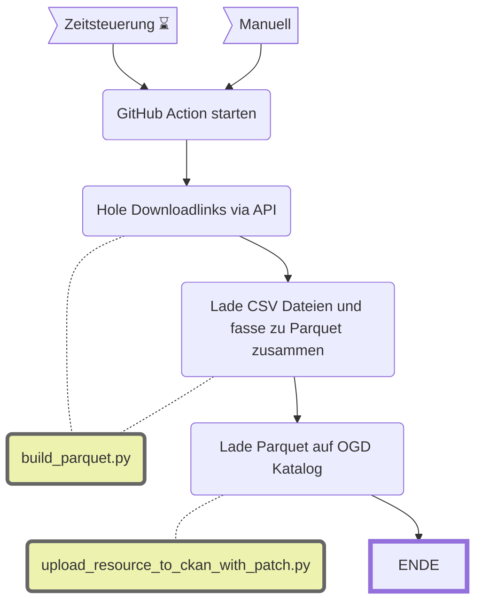

Kombiniere CSVs zu Parquets
====================

|                           | Beschreibung                         |
| ------------------------- | ------------------------------------ |
| **Status:**         | [](https://github.com/opendatazurich/opendatazurich.github.io/actions/workflows/update_combine_csv_to_parquet.yml) |
| **Workflow:**       | [`update_combine_csv_to_parquet.yml`](https://github.com/opendatazurich/opendatazurich.github.io/blob/master/.github/workflows/update_combine_csv_to_parquet.yml)  |
| **Quelle:**         | CSVs aus dem PROD [OGD-Katalog](https://data.stadt-zuerich.ch/)      |
| **Datensatz INT:**  | [Daten der Verkehrszählung zum motorisierten Individualverkehr (Stundenwerte), seit 2012](https://data.integ.stadt-zuerich.ch/dataset/int_dwh_sid_dav_verkehrszaehlung_miv_od2031), [Daten der automatischen Fussgänger- und Velozählung - Viertelstundenwerte](https://data.integ.stadt-zuerich.ch/dataset/int_dwh_ted_taz_verkehrszaehlungen_werte_fussgaenger_velo)                       |
| **Datensatz PROD:** | [Daten der Verkehrszählung zum motorisierten Individualverkehr (Stundenwerte), seit 2012](https://data.stadt-zuerich.ch/dataset/sid_dav_verkehrszaehlung_miv_od2031), [Daten der automatischen Fussgänger- und Velozählung - Viertelstundenwerte](https://data.stadt-zuerich.ch/dataset/ted_taz_verkehrszaehlungen_werte_fussgaenger_velo) |


Datenlieferanten können in einigen Fällen nur CSV Dateien zur Verfügung stellen. Wenn die CSV Dateien sehr gross sind, wird meist eine Datei für jedes Jahr erstellt. Wenn die Nutzenden die Daten desgesamten Zeitraums verwenden wollen, müssen sie unter Umständen also viele CSV Datei einlesen. Dieser Workflow soll des Prozess vereinfachen, in dem er alle CSV Dateien zu einer einzigen Parquet-Dateizusammenfasst und auf dem [OGD-Katalog](https://data.stadt-zuerich.ch/) zur Verfügung stellt.

Um diesem Workflow einen weiteren Datensatz hinzuzufügen muss man im [dataset_metadata.py](dataset_metadata.py) die Liste `dataset_metadata` um einen Dictionairy-Eintrag ergänzen. Hier ein Beispiel:
```python
        {
        "dataset_id": "ted_taz_verkehrszaehlungen_werte_fussgaenger_velo", # Dataset Slug vom OGD Katalog
        "parquet_filename": "verkehrszaehlungen_werte_fussgaenger_velo.parquet", # Dateiname des Parquet files
        "date_col": "DATUM", # Name der Datetime Spalte, falls vorhanden
        "date_format_input": "%Y-%m-%dT%H:%M", # Format, indem die Datetime Spalte daher kommt
        "dtypes": { # Datenformate, der einzelnen Spalten
            'FK_STANDORT': "Int64", 
            'DATUM': str,
            'VELO_IN': "Int64",
            'VELO_OUT': "Int64",
            'FUSS_IN': "Int64",
            'FUSS_OUT': "Int64",
            'OST': "Int64", 
            'NORD': "Int64",
            },
        }
```

Im [`update_combine_csv_to_parquet.yml`](https://github.com/opendatazurich/opendatazurich.github.io/actions/workflows/update_combine_csv_to_parquet.yml) muss für jedes erstellte Parquet-File ein Eintrag zum Upload auf den OGD Katalog gemacht werden.

Der gesamte Prozess sieht dann so aus:


