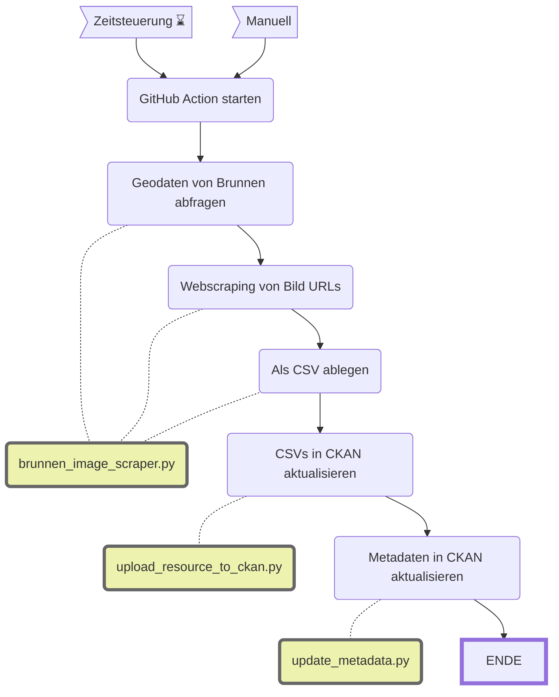

Update dib_wvz_brunnenfotos
====================

|  | Beschreibung |
| - | - |
| **Status:**  |  |
| **Workflow:**       | [`update_dib_wvz_brunnenfotos.yml`](https://github.com/opendatazurich/opendatazurich.github.io/blob/master/.github/workflows/update_dib_wvz_brunnenfotos.yml) |
| **Quelle:**         | [Geodatensatz mit den Brunnen der Stadt Zürich](https://data.stadt-zuerich.ch/dataset/geo_brunnen) und [Brunnenwebseite](https://www.stadt-zuerich.ch/de/umwelt-und-energie/wasser/trinkwasser/brunnen.html) |
| **Datensatz INT:**  | [Brunnenfotos der Stadt Zürich (data.integ.stadt-zuerich.ch)](https://data.integ.stadt-zuerich.ch/dataset/dib_wvz_brunnenfotos) |
| **Datensatz PROD:** | [Brunnenfotos der Stadt Zürich (data.stadt-zuerich.ch)](https://data.stadt-zuerich.ch/dataset/dib_wvz_brunnenfotos)  |

Dieser Datensatz ist eine Ergänzung zum [Geodatensatz mit den Brunnen der Stadt Zürich](https://data.stadt-zuerich.ch/dataset/geo_brunnen). Der Geodatensatz selbst enthält auch Links zu Fotos. Diese sind jedoch nur im Netz der Stadt Zürich zugänglich und nicht öffentlich, da einige davon urheberrechtlich geschützt sind. Dieser Workflow sammelt deswegen die URLs der öffentlich zugänglichen [Brunnenwebseite](https://www.stadt-zuerich.ch/de/umwelt-und-energie/wasser/trinkwasser/brunnen.html) und der zugehörigen Fotos per Webscraping. Über die Brunnennummer können diese Informationen mit dem Geodatensatz verknüpft werden.

**Optional** wäre es möglich die Fotos selbst herunterzuladen und als ZIP zu speichern über die Funktionen `download_images` und `zip_images`. Das ist im Moment aber nicht nötig, deswegen ist das auskommentiert.

