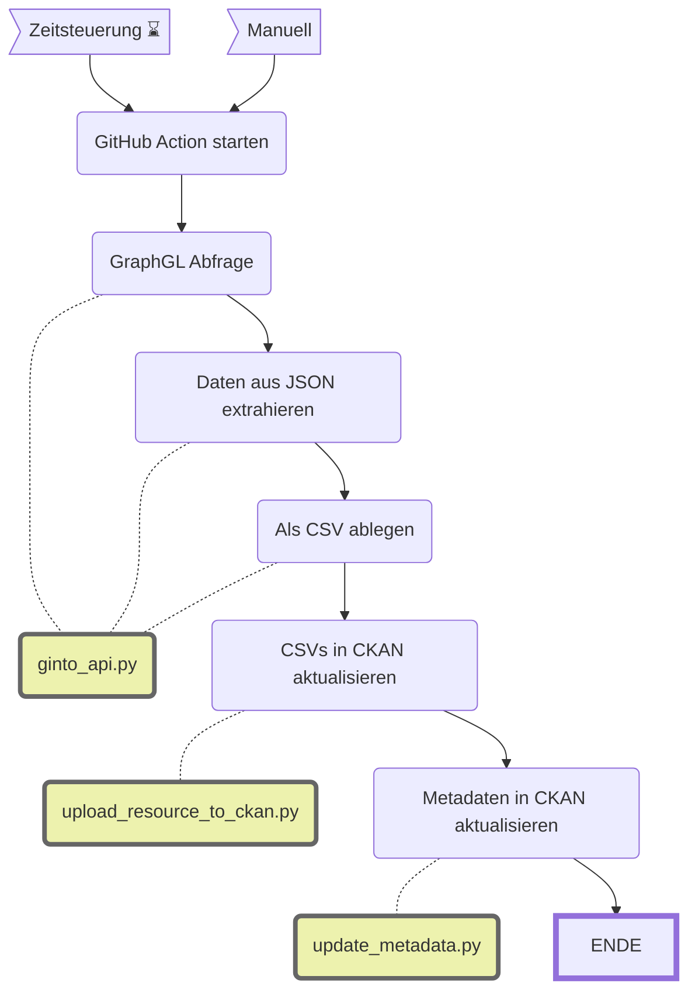

Update immo_ginto_zugaenglichkeit
====================

|  | Beschreibung |
| - | - |
| **Status:**  | [](https://github.com/opendatazurich/opendatazurich.github.io/actions/workflows/update_immo_ginto_zugaenglichkeit.yml) |
| **Workflow:**       | [`update_immo_ginto_zugaenglichkeit.yml`](https://github.com/opendatazurich/opendatazurich.github.io/blob/master/.github/workflows/update_immo_ginto_zugaenglichkeit.yml) |
| **Quelle:**         | [Ginto API](https://api.ginto.guide/graphql) |
| **Datensatz INT:**  | [Informationen zur Zugänglichkeit öffentlicher Gebäude der Stadt Zürich (data.integ.stadt-zuerich.ch)](https://data.integ.stadt-zuerich.ch/dataset/immo_ginto_zugaenglichkeit) |
| **Datensatz PROD:** | [Informationen zur Zugänglichkeit öffentlicher Gebäude der Stadt Zürich (data.stadt-zuerich.ch)](https://data.stadt-zuerich.ch/dataset/immo_ginto_zugaenglichkeit)  |

Dieser Workflow lädt Daten von der GraphQL-API von [Ginto](https://www.ginto.guide/). Details zur Schnittstelle finden sich hier: https://about.ginto.guide/course/api. Über den Postman Account von OpenDataZurich können die Queries auch genauer inspiziert werden.

Die Abfrage verwendet einen Filter (siehe `FILTER_ID`), der für uns von Ginto/ProInfirmis erstellt wurde. Er enthält die Objekte, für die eine Pro Infirmis Erfassung existiert.

Die Ergebnisse je Objekt können (müssen aber nicht) verschieden Arten von Bewertungen erhalten, zum Beispiel ob die Toilette rollstuhlgängig ist, oder ob es eine Induktionsschleife hat. Diese Bewertungen werden alle in separate Spalten entpackt. Sollte es eine neue Art von Bewertungen geben, muss diese in der Funktion `extract_default_ratings` ergänzt werden. Hier der aktuelle Stand:

```python
rating_types = ["toilet", "parking", "visual", "cognitive", "inductive"]
```
Der Ratingtyp `general` ist der allgemeine Ratingtyp. Er ist nicht über ein eindeutiges Keyword zu identifizieren. Deswegen ist das er Typ der übrig bleibt beim Matching.



