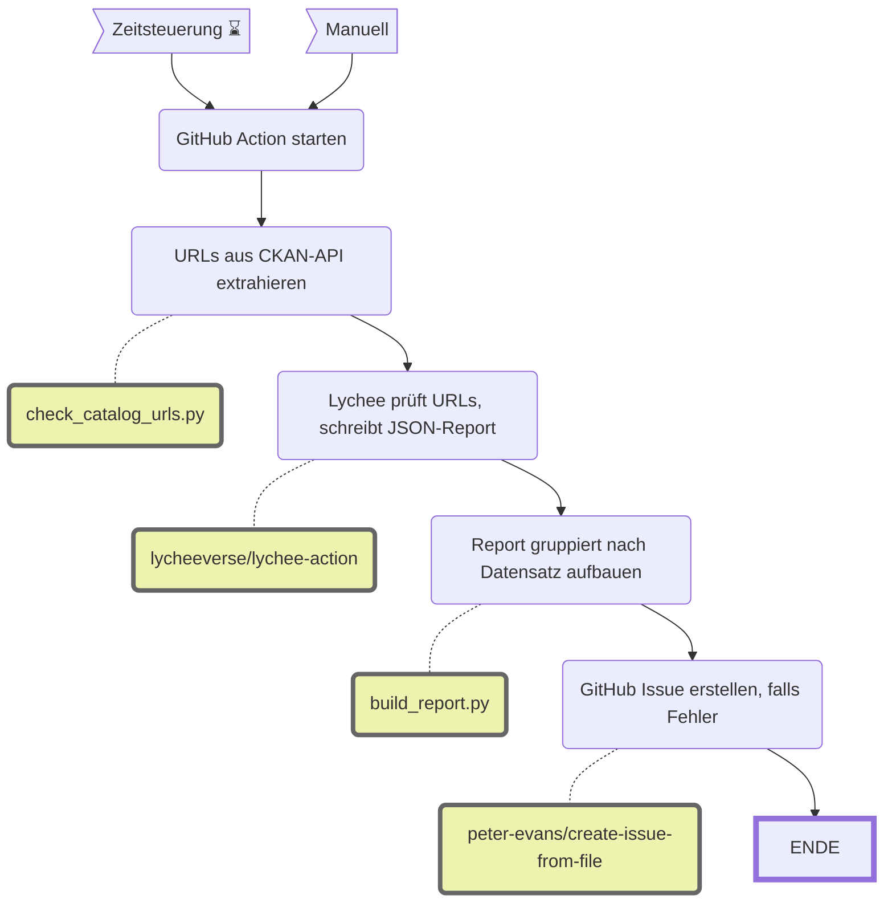

Link Checker: Tote Links in Repo und CKAN-Katalog finden
========================================================

||Beschreibung|
|---|---|
|**Status:**|[](https://github.com/opendatazurich/opendatazurich.github.io/actions/workflows/link_checker.yml)|
|**Workflow:**|[`link_checker.yml`](https://github.com/opendatazurich/opendatazurich.github.io/blob/master/.github/workflows/link_checker.yml)|
|**Quelle:**| Repository-Dateien und [CKAN API](https://data.stadt-zuerich.ch/api/3/action/current_package_list_with_resources)|
|**Output:**| GitHub Issues mit Label `report`, `automated issue` (Repo) bzw. zusätzlich `catalog` (Katalog)|

Der Workflow prüft URLs auf tote Links und erstellt bei Bedarf ein GitHub Issue mit dem Report. Er läuft manuell (`workflow_dispatch`) oder via `repository_dispatch`.

Für die eigentliche HTTP-Prüfung wird [lychee](https://github.com/lycheeverse/lychee) verwendet.

# Zwei Jobs

## Job 1: `linkChecker` — Repo-Dateien

Prüft alle URLs, die in den Dateien des Repositories vorkommen (Markdown, YAML, Python-Skripte etc.). Lychee scannt das Verzeichnis direkt.

Ausgeschlossene Domains (via `--exclude`):
- `data.integ.stadt-zuerich.ch/*` (SSL-Probleme)
- `confluence-ssz.szh.loc*` (intern)
- `github.com/opendatazurich/opendatazurich.github.io/settings/*` (Auth-geschützt)

## Job 2: `linkCheckerCatalog` — CKAN-Katalog

Prüft alle URLs, die im Open-Data-Katalog der Stadt Zürich vorkommen. Der Ablauf besteht aus drei Skripten:



### URL-Quellen pro Datensatz

Aus jedem CKAN-Paket werden URLs aus drei Feldern extrahiert:

1. **`resources[].url`** — direkte Download- und API-Endpunkte (höchster Vorrang beim Dataset-Mapping)
2. **`sszBemerkungen`** — Markdown-Links `[text](url)`
3. **`notes`** — URLs im Fliesstext (Beschreibung)

Deduplizierung via `set()`. Nur `http://`/`https://` werden gehalten; `data.integ.stadt-zuerich.ch` ist ausgeschlossen (SSL-Probleme).

### Ausgabe-Artefakte

| Datei | Inhalt |
|---|---|
| `.cache/catalog_urls.txt` | Deduplizierte URL-Liste (Input für Lychee) |
| `.cache/url_dataset_map.json` | Mapping URL → Dataset-Name (für Report-Aufbau) |
| `lychee/out.json` | Lychees strukturierter JSON-Report |
| `lychee/out.md` | Finaler Markdown-Report, gruppiert nach Datensatz (wird zum Issue-Body) |

### Report-Format

Der Issue-Body listet die fehlerhaften URLs gruppiert nach Datensatz-Namen (CKAN `name`):

```markdown
# Link Checker Report (Catalog)

**3 fehlerhafte URLs** von 5198 geprüft — aus 2 Datensätzen.

## dataset-name-a
- `HTTP 404 Not Found` https://example.com/broken
- `Timeout` https://slow.example.com

## dataset-name-b
- `Error: connection refused` https://other.example
```

### Lychee-Konfiguration

- `--accept '200..=204,403,429,500'` — 403/429/500 werden akzeptiert (oft Rate-Limits oder Anti-Scraping, keine echten Fehler)
- `--max-retries 5 --retry-wait-time 5` — tolerant gegenüber 429
- `--max-concurrency 10` — schonende Parallelität
- `--format json` — strukturierter Output für [`build_report.py`](build_report.py)

# Manuelle Ausführung lokal

```bash
# 1. URLs aus CKAN extrahieren
python automation/link_checker/check_catalog_urls.py

# 2. Lychee installieren und ausführen
lychee --accept '200..=204,403,429,500' --max-retries 5 --retry-wait-time 5 \
       --max-concurrency 10 --format json --output lychee/out.json \
       .cache/catalog_urls.txt

# 3. Report bauen
python automation/link_checker/build_report.py

# 4. Report ansehen
cat lychee/out.md
```

Alle Skripte nutzen nur die Python-Standardbibliothek — keine zusätzlichen Dependencies.

# Dateien

| Datei | Zweck |
|---|---|
| [`check_catalog_urls.py`](check_catalog_urls.py) | URL-Extraktion aus CKAN-API |
| [`build_report.py`](build_report.py) | Report-Aufbau aus Lychee-JSON |
