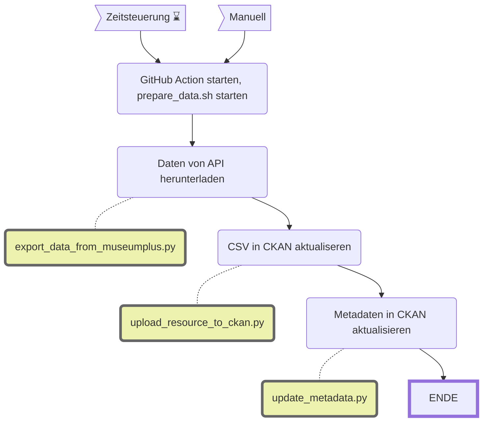

MRZ Himmelheber
==============

||Beschreibung|
|---|---|
|**Status:**| |
|**Workflow:**| [`update_mrz_himmelheber.yml`](https://github.com/opendatazurich/opendatazurich.github.io/blob/master/.github/workflows/update_mrz_himmelheber.yml)|
|**Quelle:**| MuseumPlus |
|**Datensatz INT:**|[Objekte im Archiv von Hans Himmelheber (1908–2003) im Museum Rietberg (data.integ.stadt-zuerich.ch)](https://data.integ.stadt-zuerich.ch/dataset/mrz_himmelheber_objekte)  [Fotos im Archiv von Hans Himmelheber (1908–2003) im Museum Rietberg (data.integ.stadt-zuerich.ch)](https://data.integ.stadt-zuerich.ch/dataset/mrz_himmelheber_fotos)|
|**Datensatz PROD:**|[Objekte im Archiv von Hans Himmelheber (1908–2003) im Museum Rietberg (data.stadt-zuerich.ch)](https://data.stadt-zuerich.ch/dataset/mrz_himmelheber_objekte)  [Fotos im Archiv von Hans Himmelheber (1908–2003) im Museum Rietberg (data.stadt-zuerich.ch)](https://data.stadt-zuerich.ch/dataset/mrz_himmelheber_fotos)
|

Die Daten werden durch das Museum Rietberg via MuseumPlus zur Verfügung gestellt. In MuseumPlus wurde dazu ein "Export" erstellt, so hat MRZ volle Kontrolle über Forum und Inhalt des CSVs.

Die Skripts werden alle in [`prepare_data.sh`](https://github.com/opendatazurich/opendatazurich.github.io/blob/master/automation/mrz_himmelheber/prepare_data.sh) ausgeführt und schlussendlich das erstellte CSV in CKAN hochgeladen.

