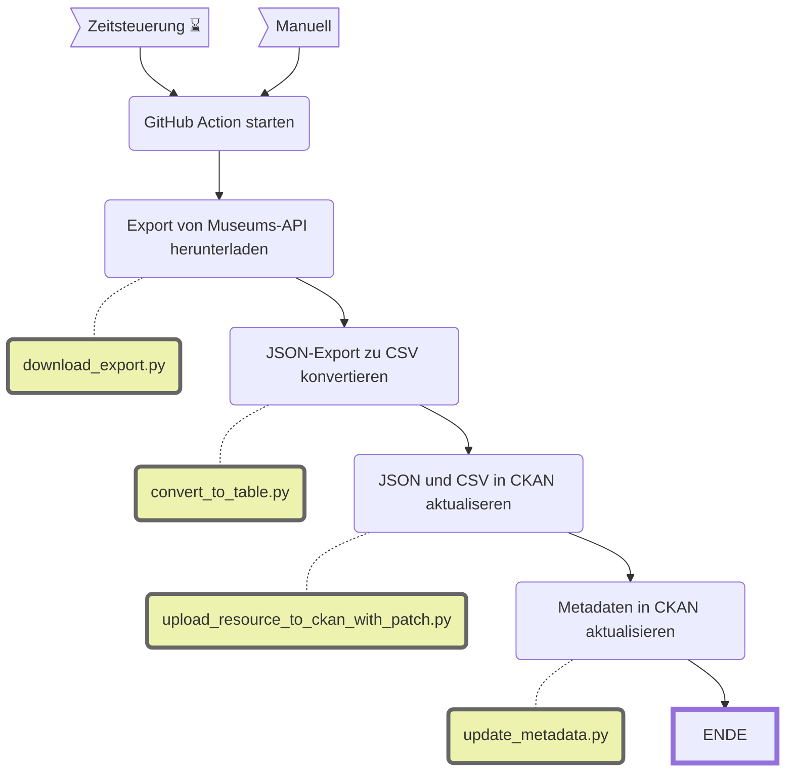

MRZ Kamerun Objekte
==============

||Beschreibung|
|---|---|
|**Status:**| |
|**Workflow:**| [`update_mrz_kamerun_objekte.yml`](https://github.com/opendatazurich/opendatazurich.github.io/blob/master/.github/workflows/update_mrz_kamerun_objekte.yml)|
|**Quelle:**| MuseumPlus |
|**Datensatz INT:**|[Kamerun Sammlungen am MRZ (data.integ.stadt-zuerich.ch)](https://data.integ.stadt-zuerich.ch/dataset/mrz_kamerun_objekte)|
|**Datensatz PROD:**|[Kamerun Sammlungen am MRZ (data.stadt-zuerich.ch)](https://data.stadt-zuerich.ch/dataset/mrz_kamerun_objekte)|

Die Daten werden durch das Museum Rietberg via MuseumPlus zur Verfügung gestellt. In MuseumPlus wurde dazu ein "Export" erstellt, so hat MRZ volle Kontrolle über Forum und Inhalt des Exports.

Der Export des MRZ hat die ID `71028`. Die Suche läuft im Modul Objekte (`Object`), und soll alle Datensätze mit der Objektgruppe (`ObjObjectGroupsRef`) mit ID `51030` ausgeben. Im Moment sind das ca. 85 Objekte. Alle haben einen Geographischen Bezug, der in irgendeiner Weise "Kamerun" enthält.

