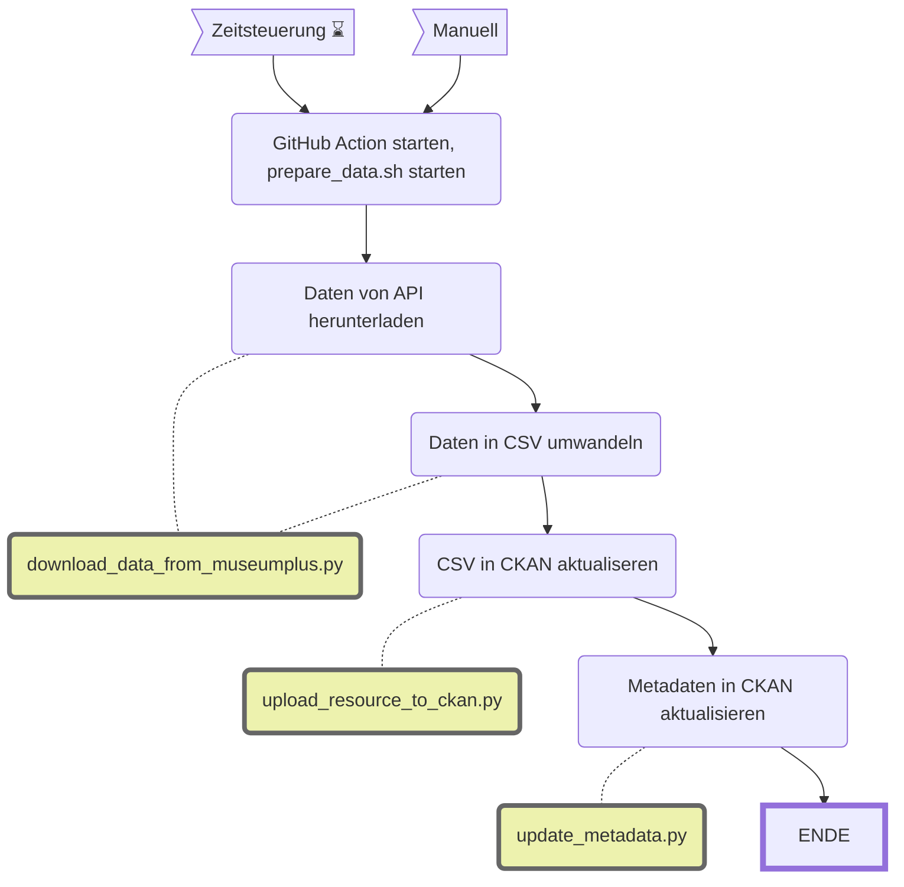

MRZ Patolu
==============

||Beschreibung|
|---|---|
|**Status:**| |
|**Workflow:**| [`update_mrz_patolu.yml`](https://github.com/opendatazurich/opendatazurich.github.io/blob/master/.github/workflows/update_mrz_patolu.yml)|
|**Quelle:**| MuseumPlus |
|**Datensatz INT:**|[Patolu – Indische Textilien aus der Sammlung des Museums Rietberg (data.integ.stadt-zuerich.ch)](https://data.integ.stadt-zuerich.ch/dataset/mrz_patolu)|
|**Datensatz PROD:**|[Patolu – Indische Textilien aus der Sammlung des Museums Rietberg (data.stadt-zuerich.ch)](https://data.stadt-zuerich.ch/dataset/mrz_patolu))|

Die Daten werden durch das Museum Rietberg via MuseumPlus zur Verfügung gestellt. Die zugehörigen Bild-Dateien wurden einmalig manuell hochgeladen (kein Update vorgesehen).

Die Skripts werden alle in [`prepare_data.sh`](https://github.com/opendatazurich/opendatazurich.github.io/blob/master/automation/mrz_patolu/prepare_data.sh) ausgeführt und schlussendlich das erstellte CSV in CKAN hochgeladen.

