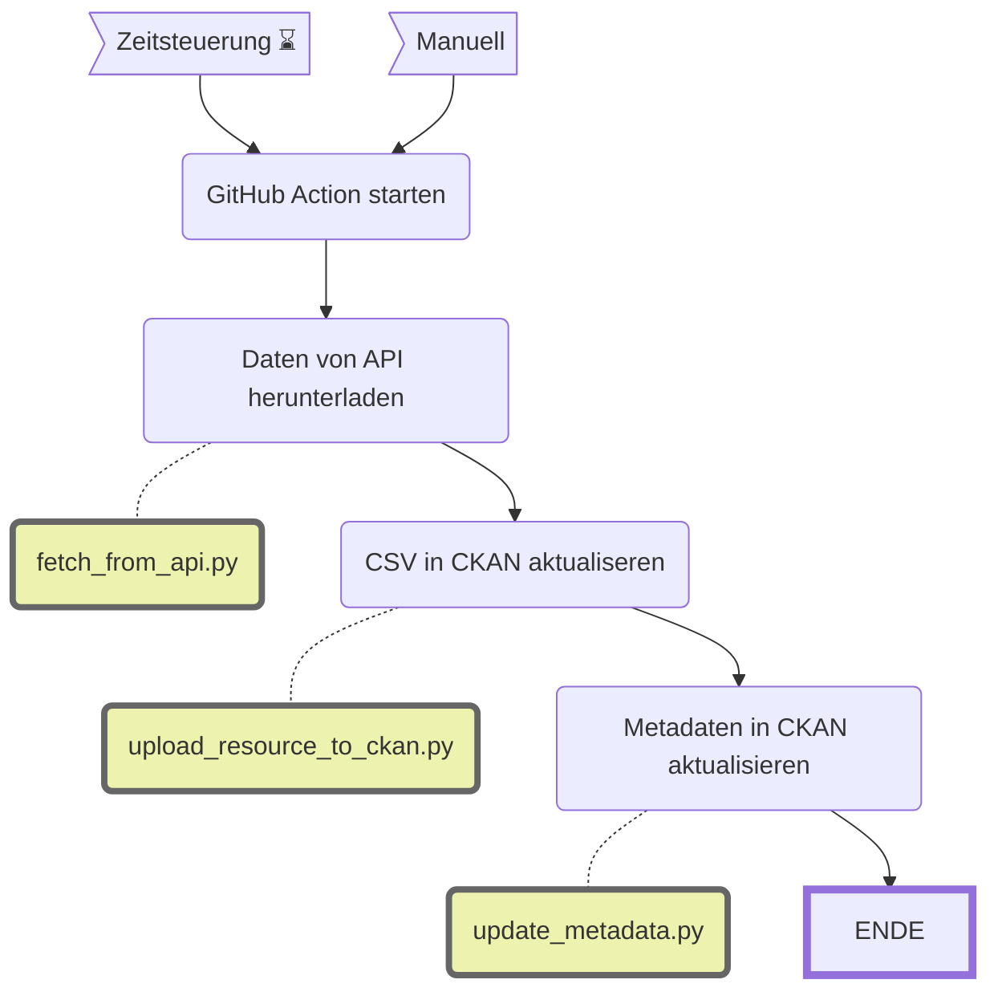

Dateninventar des OGD-Katalogs
==============================

||Beschreibung|
|---|---|
|**Status:**||
|**Workflow:**|[`update_ckan_metadata.yml`](https://github.com/opendatazurich/opendatazurich.github.io/actions/workflows/update_ckan_metadata.yml)|
|**Quelle:**| [OGD Katalog](https://data.stadt-zuerich.ch/)
|**Datensatz INT:**|[Dateninventar des OGD-Katalogs der Stadt Zürich (data.integ.stadt-zuerich.ch)](https://data.integ.stadt-zuerich.ch/dataset/int_dwh_prd_ssz_ogd_katalog_inventar)|
|**Datensatz PROD:**|[Dateninventar des OGD-Katalogs der Stadt Zürich (data.stadt-zuerich.ch)](https://data.stadt-zuerich.ch/dataset/prd_ssz_ogd_katalog_inventar)|

Die wichtigsten Metadaten aller veröffentlichten Datensätze des [OGD-Katalog](https://data.stadt-zuerich.ch/) mittels der [CKAN API](https://docs.ckan.org/en/2.9/api/) bezogen und als Dateninventar wiederum zur Verfügung gestellt.

Das Skript [`fetch_from_api.py`](https://github.com/opendatazurich/opendatazurich.github.io/blob/master/automation/ogd_metadata/fetch_from_api.py) lädt die aktuellen Daten, anschliessend wird das resultierende CSV zu CKAN hochgeladen. 

