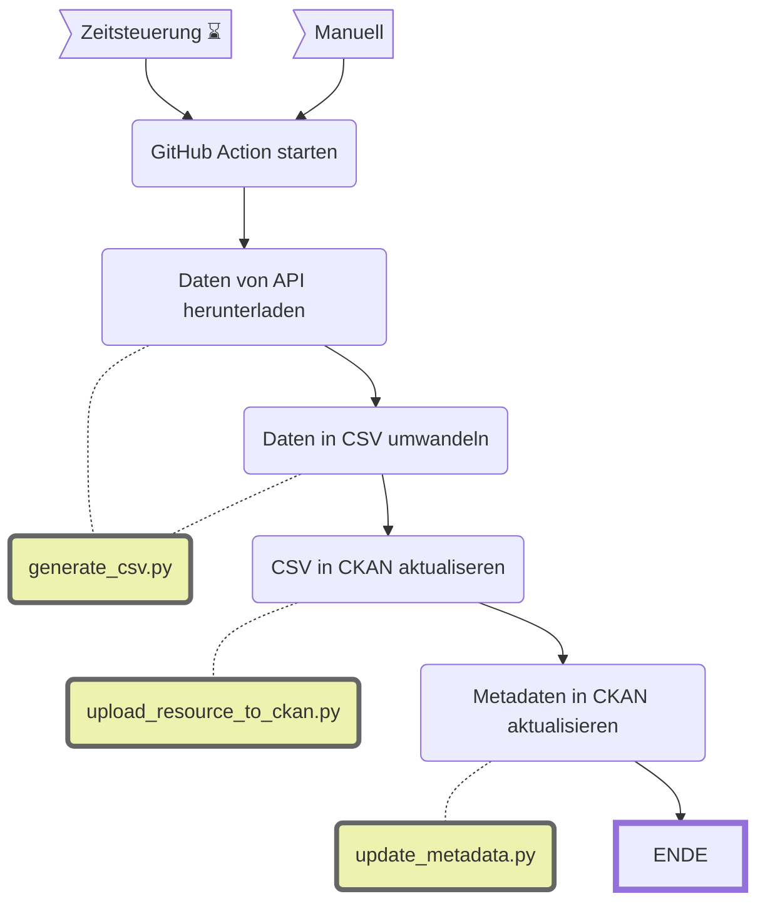

Stadtarchiv: Historische Geschäftsberichte
===========================================

||Beschreibung|
|---|---|
|**Status:**||
|**Workflow:**|[`update_sar_geschaeftsberichte.yml`](https://github.com/opendatazurich/opendatazurich.github.io/blob/master/.github/workflows/update_sar_geschaeftsberichte.yml)|
|**Quelle:**| [Elektronischer Archivkatalog (Query)](https://amsquery.stadt-zuerich.ch/suchinfo.aspx) des Stadtarchivs (via SRU-Schnittstelle)
|**Datensatz INT:**|[Geschäftsberichte des Stadtrats, ab 1859 (data.integ.stadt-zuerich.ch)](https://data.integ.stadt-zuerich.ch/dataset/sar_geschaeftsberichte)|
|**Datensatz PROD:**|[Geschäftsberichte des Stadtrats, ab 1859 (data.stadt-zuerich.ch)](https://data.stadt-zuerich.ch/dataset/sar_geschaeftsberichte)|

Die Daten durch das Stadtarchiv via SRU-Schnittstelle ihres Archivkatalogs zur Verfügung gestellt.

Das Skript [`generate_csv.py`](https://github.com/opendatazurich/opendatazurich.github.io/blob/master/automation/sar_geschaeftsberichte/generate_csv.py) lädt die aktuellen Daten, anschliessend wird das resultierende CSV zu CKAN hochgeladen. 

