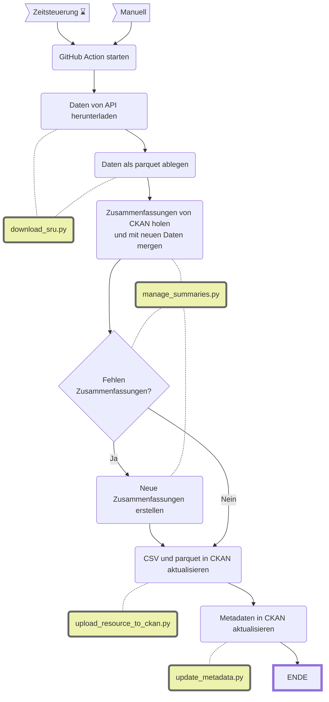

Inventar Hauptarchiv des Stadtarchivs
=====================================

|                           | Beschreibung                                                                                                                                                                                                                                                                 |
| ------------------------- | ---------------------------------------------------------------------------------------------------------------------------------------------------------------------------------------------------------------------------------------------------------------------------- |
| **Status:**         |  |
| **Workflow:**       | [`update_sar_geschaeftsberichte.yml`](https://github.com/opendatazurich/opendatazurich.github.io/blob/master/.github/workflows/update_sar_geschaeftsberichte.yml)                                                                                                             |
| **Quelle:**         | [Elektronischer Archivkatalog (Query)](https://amsquery.stadt-zuerich.ch/suchinfo.aspx) des Stadtarchivs (via SRU-Schnittstelle)                                                                                                                                                |
| **Datensatz INT:**  | [Inventar Hauptarchiv des Stadtarchivs (data.integ.stadt-zuerich.ch)](https://data.integ.stadt-zuerich.ch/dataset/int_dwh_sar_inventar_hauptarchiv)                                                                                                                             |
| **Datensatz PROD:** | [Inventar Hauptarchiv des Stadtarchivs (data.stadt-zuerich.ch)](https://data.stadt-zuerich.ch/dataset/sar_inventar_hauptarchiv)                                                                                                                                                 |

Die Daten werden durch das Stadtarchiv via SRU-Schnittstelle ihres Archivkatalogs zur Verfügung gestellt.

Das Skript `download_sru.py` lädt das aktuelle Inventar herunter und speichert das Ergebnis als parquet. Das Skript `manage_summaries.py` lädt den bisherigen Stand vom OGD Katalog herunter. Davon werden die bestehenden Zusammenfassungen übernommen und an das neue Inventar gejoined. Sollte es Downloadlinks geben, für die noch keine Zusammenfassung vorhanden ist, versucht das Skript diese Zusammenfassungen von einem AI Modell erstellen zu lassen.

Es gibt in `summarize_text.py` verschiedene APIs zur Auswahl (z.B. von Hugging Face, OpenAI oder Google). Die sind alle getestet und funktionieren grundsätzlich. Voraussetzung ist, dass man ein entsprechendes API Token hat und ggf. die Gebühren bezahlen kann. Die Anbieter haben alle verschiedene Vor- und Nachteile. Im Moment wird die Google API verwendet, weil sie kostenlos ist und das Kontextfenster deutlich grösser ist, als bei den anderen (einige der Dokumente sind sehr gross).

