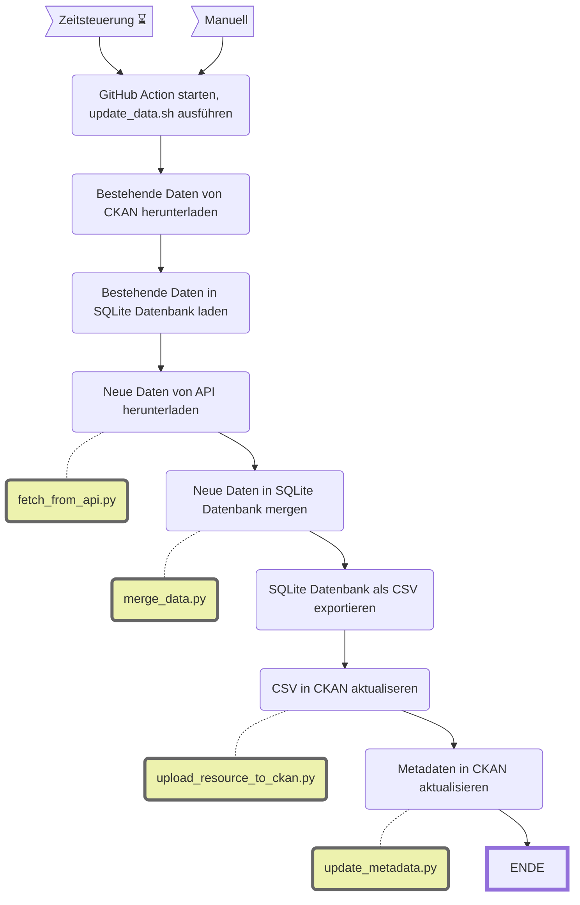

Schulferien
=============

||Beschreibung|
|---|---|
|**Status:**||
|**Workflow:**|[`update_schulferien.yml`](https://github.com/opendatazurich/opendatazurich.github.io/actions/workflows/update_schulferien.yml)|
|**Quelle:**| [ICS-Dateien von der Webseite des Schulamts](https://www.stadt-zuerich.ch/ssd/de/index/volksschule/schulferien.html)
|**Datensatz INT:**|[Ferien und schulfreie Tage der Volksschule der Stadt Zürich, Schuljahre 2020/2021 bis 2024/2025 (data.integ.stadt-zuerich.ch)](https://data.integ.stadt-zuerich.ch/dataset/ssd_schulferien)|
|**Datensatz PROD:**|[Ferien und schulfreie Tage der Volksschule der Stadt Zürich, Schuljahre 2020/2021 bis 2024/2025 (data.stadt-zuerich.ch)](https://data.stadt-zuerich.ch/dataset/ssd_schulferien)|

Die Daten werden vom Schulamt [via Webseite als ICS](https://www.stadt-zuerich.ch/ssd/de/index/volksschule/schulferien.html) zur Verfügung gestellt.

Die Skripte werden alle in [`run_scraper.sh`](https://github.com/opendatazurich/opendatazurich.github.io/blob/master/automation/schulferien/run_scraper.sh) und schlussendlich das erstellte CSV im Repository und in CKAN hochgeladen.

