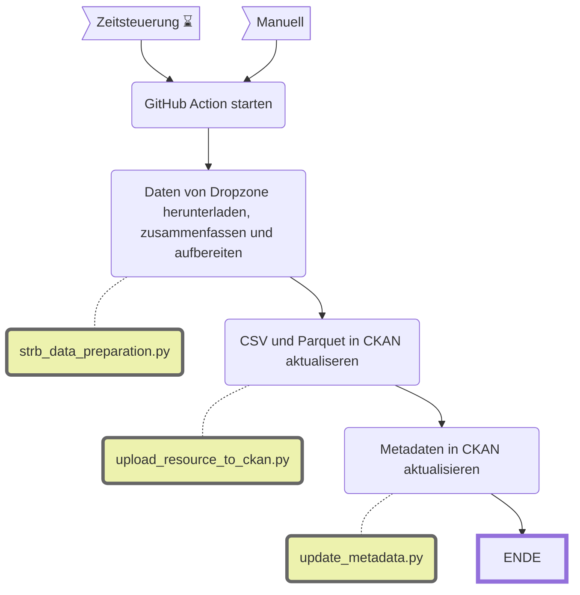

Stadtratsbeschlüsse: Daten zusammen fassen und aufbereiten
===========================================

|                           | Beschreibung                                                                                                                                                                                                                                                                                         |
| ------------------------- | ---------------------------------------------------------------------------------------------------------------------------------------------------------------------------------------------------------------------------------------------------------------------------------------------------- |
| **Status:**         |  |
| **Workflow:**       | [`update_stadtratsbeschluesse.yml`](https://github.com/opendatazurich/opendatazurich.github.io/blob/master/.github/workflows/update_stadtratsbeschluesse.yml)                                                                                                                     |
| **Quelle:**         | [WebDAV OGD Dropzone](https://www.ssz-webdav.stadt-zuerich.ch/OGD_Dropzone/)                                                                                                                                                                                                                                                          |
| **Datensatz INT:**  | [Öffentliche Stadtratsbeschlüsse (data.integ.stadt-zuerich.ch)](https://data.integ.stadt-zuerich.ch/dataset/int_av_av_skz_strb_oe_datum)                                                                                                                                    |
| **Datensatz PROD:** | [Öffentliche Stadtratsbeschlüsse (data.stadt-zuerich.ch)](https://data.stadt-zuerich.ch/dataset/av_skz_strb_oe_datum)                                                                                                                                                |

Die Daten werden in den Ordner `/INT_AV/av_skz_strb_oe_datum` auf der OGD Dropzone geliefert. Es gibt ein CSV für jede Woche.

Das Skript [`fetch_from_api.py`](https://github.com/opendatazurich/opendatazurich.github.io/blob/master/automation/stadtratsbeschluesse/strb_data_preparation.py) fasst alle CSVs zu einer Datei zusammen. Die Daten werden nach den Anforderungen von OpenDataZurich aufbereitet. Ausserdem werden noch URLs zur Webseite der Stadt hinzugefügt, wo der jeweilige Stadtratsbeschluss heruntergeladen werden kann.

