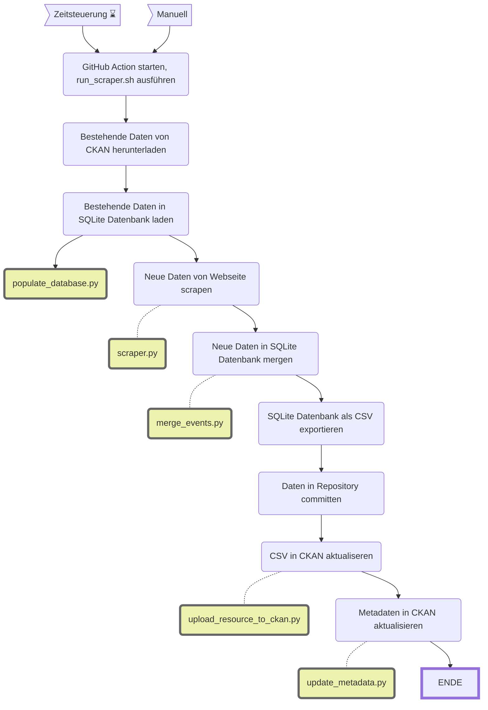

Stimmbeteiligung vor Urnengängen
=================================

||Beschreibung|
|---|---|
|**Status:**||
|**Workflow:**|[`update_stimmbeteiligung.yml`](https://github.com/opendatazurich/opendatazurich.github.io/blob/master/.github/workflows/update_stimmbeteiligung.yml)|
|**Quelle:**| [Webseite der Stadtkanzlei](https://www.stadt-zuerich.ch/portal/de/index/politik_u_recht/abstimmungen_u_wahlen/aktuell/stand-stimmbeteiligung.html)
|**Datensatz INT:**|[Stimmbeteiligung in Prozent vor Urnengängen (data.integ.stadt-zuerich.ch)](https://data.integ.stadt-zuerich.ch/dataset/politik_stimmbeteiligung-vor-urnengangen)|
|**Datensatz PROD:**|[Stimmbeteiligung in Prozent vor Urnengängen (data.stadt-zuerich.ch)](https://data.stadt-zuerich.ch/dataset/politik_stimmbeteiligung-vor-urnengangen)|

Die Daten werden von der [Webseite der Stadtkanzlei](https://www.stadt-zuerich.ch/portal/de/index/politik_u_recht/abstimmungen_u_wahlen/aktuell/stand-stimmbeteiligung.html) gescrapt.

Die Skripte werden alle in [`run_scraper.sh`](https://github.com/opendatazurich/opendatazurich.github.io/blob/master/automation/stimmbeteiligung/run_scraper.sh) und schlussendlich das erstellte CSV im Repository und in CKAN hochgeladen.

