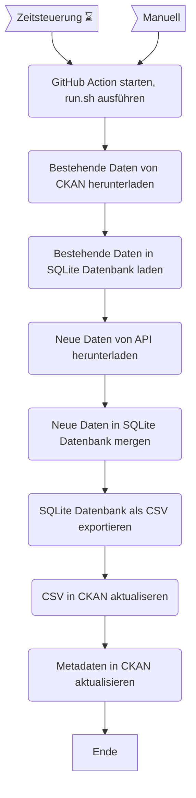

VBZ Passagierfrequenzen
=======================

||Beschreibung|
|---|---|
|**Workflow:**|[`update_vbz_frequenzen_hardbruecke.yml`](https://github.com/opendatazurich/opendatazurich.github.io/blob/master/.github/workflows/update_vbz_frequenzen_hardbruecke.yml)|
|**Quelle:**| VBZ API
|**Datensatz INT:**|[Fahrgastfrequenzen an der VBZ-Haltestelle Hardbrücke (data.stadt-zuerich.ch)](https://data.stadt-zuerich.ch/dataset/vbz_frequenzen_hardbruecke)|
|**Datensatz PROD:**|[Fahrgastfrequenzen an der VBZ-Haltestelle Hardbrücke (data.integ.stadt-zuerich.ch)](https://data.integ.stadt-zuerich.ch/dataset/vbz_frequenzen_hardbruecke)|

Die Daten werden von der VBZ via ein API zur Verfügung gestellt.

Das [Workflow-YAML]([https://github.com/opendatazurich/opendatazurich.github.io/blob/master/.github/workflows/update_wapo_wetterstationen.yml](https://github.com/opendatazurich/opendatazurich.github.io/blob/master/.github/workflows/update_vbz_frequenzen_hardbruecke.yml)) beschreibt den Ablauf im Detail.
Die Skripts werden alle in `update_data.sh` und schlussendlich das erstellte CSV in CKAN hochgeladen.

