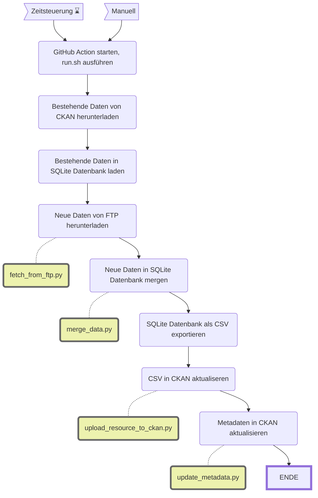

WAPO Wetterstationen
====================

||Beschreibung|
|---|---|
|**Workflow:**|[`update_wapo_wetterstationen.yml`](https://github.com/opendatazurich/opendatazurich.github.io/blob/master/.github/workflows/update_wapo_wetterstationen.yml)|
|**Quelle:**| FTP-Server
|**Datensatz INT:**|[Messwerte der Wetterstationen der Wasserschutzpolizei Zürich (data.stadt-zuerich.ch)](https://data.stadt-zuerich.ch/dataset/sid_wapo_wetterstationen)|
|**Datensatz PROD:**|[Messwerte der Wetterstationen der Wasserschutzpolizei Zürich (data.integ.stadt-zuerich.ch)](https://data.integ.stadt-zuerich.ch/dataset/sid_wapo_wetterstationen))|

Die Daten der beiden Wetterstationen Mythenquai und Tiefenbrunnen der Wasserschutzpolizei (WAPO) werden uns durch die Tecson AG via FTP-Server bereitgestellt.

Das [Workflow-YAML](https://github.com/opendatazurich/opendatazurich.github.io/blob/master/.github/workflows/update_wapo_wetterstationen.yml) beschreibt den Ablauf im Detail.
Die Skripts werden alle in `run.sh` und schlussendlich das erstellte CSV wieder in CKAN hochgeladen.

