WAPO Wetterstationen
====================

Die Daten der beiden Wetterstationen Mythenquai und Tiefenbrunnen der Wasserschutzpolizei (WAPO) werden uns durch die Tecson AG via FTP-Server bereitgestellt.

Das [Workflow-YAML](https://github.com/opendatazurich/opendatazurich.github.io/blob/master/.github/workflows/update_wapo_wetterstationen.yml) beschreibt den Ablauf im Detail.
Die Skripts werden alle in `run.sh` und schlussendlich das erstellte CSV wieder in CKAN hochgeladen.

```mermaid
flowchart TD
    Zeit>"Zeitsteuerung ⌛️"]
    Manuell>"Manuell"]
    Start(GitHub Action starten, run.sh ausführen)
    Zeit --> Start
    Manuell --> Start
    Start --> DatenVonCKAN(Bestehende Daten von CKAN herunterladen)
    DatenVonCKAN --> DatenInDB(Bestehende Daten in SQLite Datenbank laden)
    DatenInDB --> FTP(Neue Daten von FTP herunterladen)
    FTP --> Merge(Neue Daten in SQLite Datenbank mergen)
    Merge --> Export(SQLite Datenbank als CSV exportieren)
    Export --> DataUpdate(CSV in CKAN aktualiseren)
    DataUpdate --> MetadataUpdate(Metadaten in CKAN aktualisieren)
    MetadataUpdate --> Ende
```

