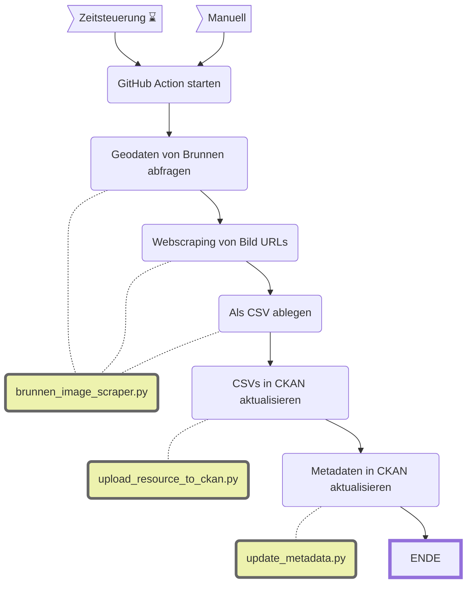

Update WVZ Brunnenbilder
====================

|  | Beschreibung |
| - | - |
| **Status:**  |  |
| **Workflow:**       | [`update_wvz_brunnenbilder.yml`](https://github.com/opendatazurich/opendatazurich.github.io/blob/master/.github/workflows/update_wvz_brunnenbilder.yml) |
| **Quelle:**         | [Geodatensatz mit den Brunnen der Stadt Zürich](https://data.stadt-zuerich.ch/dataset/geo_brunnen) und [Brunnenwebseite](https://www.stadt-zuerich.ch/de/umwelt-und-energie/wasser/trinkwasser/brunnen.html) |
| **Datensatz INT:**  | [Brunnenbilder (data.integ.stadt-zuerich.ch)](https://data.integ.stadt-zuerich.ch/dataset/dib_wvz_brunnenbilder) |
| **Datensatz PROD:** | [Brunnenbilder (data.stadt-zuerich.ch)](https://data.stadt-zuerich.ch/dataset/dib_wvz_brunnenbilder)  |

Dieser Datensatz ist eine Ergänzung zum [Geodatensatz mit den Brunnen der Stadt Zürich](https://data.stadt-zuerich.ch/dataset/geo_brunnen). Der Geodatensatz selbst enthält auch Links zu Bildern. Diese sind jedoch nur im Netz der Stadt Zürich zugänglich und nicht öffentlich, da einige davon urheberrechtlich geschützt sind. Dieser Workflow sammelt deswegen die URLs der öffentlich zugänglichen [Brunnenwebseite](https://www.stadt-zuerich.ch/de/umwelt-und-energie/wasser/trinkwasser/brunnen.html) und der zugehörigen Bilder per Webscraping. Über die Brunnennummer können diese Informationen mit dem Geodatensatz verknüpft werden.

**Optional** wäre es möglich die Bilder selbst herunterzuladen und als ZIP zu speichern über die Funktionen `download_images` und `zip_images`. Das ist im Moment aber nicht nötig, deswegen ist das auskommentiert.

