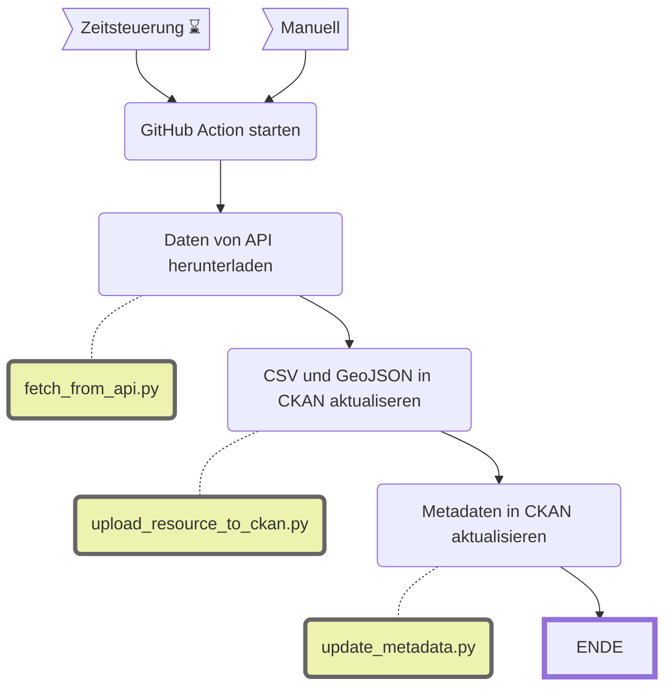

Hystreet: Fussgängerfrequenzen an der Bahnhofstrasse
====================================================

||Beschreibung|
|---|---|
|**Status:**||
|**Workflow:**|[`update_hystreet_fussgaengerfrequenzen.yml`](https://github.com/opendatazurich/opendatazurich.github.io/blob/master/.github/workflows/update_hystreet_fussgaengerfrequenzen.yml)|
|**Quelle:**| [Hystreet API](https://static.hystreet.com/#/)
|**Datensatz INT:**|[Passantenfrequenzen an der Bahnhofstrasse - Stundenwerte (data.integ.stadt-zuerich.ch)](https://data.integ.stadt-zuerich.ch/dataset/hystreet_fussgaengerfrequenzen)|
|**Datensatz PROD:**|[Passantenfrequenzen an der Bahnhofstrasse - Stundenwerte (data.stadt-zuerich.ch)](https://data.stadt-zuerich.ch/dataset/hystreet_fussgaengerfrequenzen)|

Die Daten werden von Hystreet via ein [API](https://static.hystreet.com/#/) zur Verfügung gestellt.

Das Skript [`fetch_from_api.py`](https://github.com/opendatazurich/opendatazurich.github.io/blob/master/automation/hystreet_fussgaengerfrequenzen/fetch_from_api.py) lädt die aktuellen Daten, anschliessend wird das resultierende CSV und GeoJSON zu CKAN hochgeladen. 

