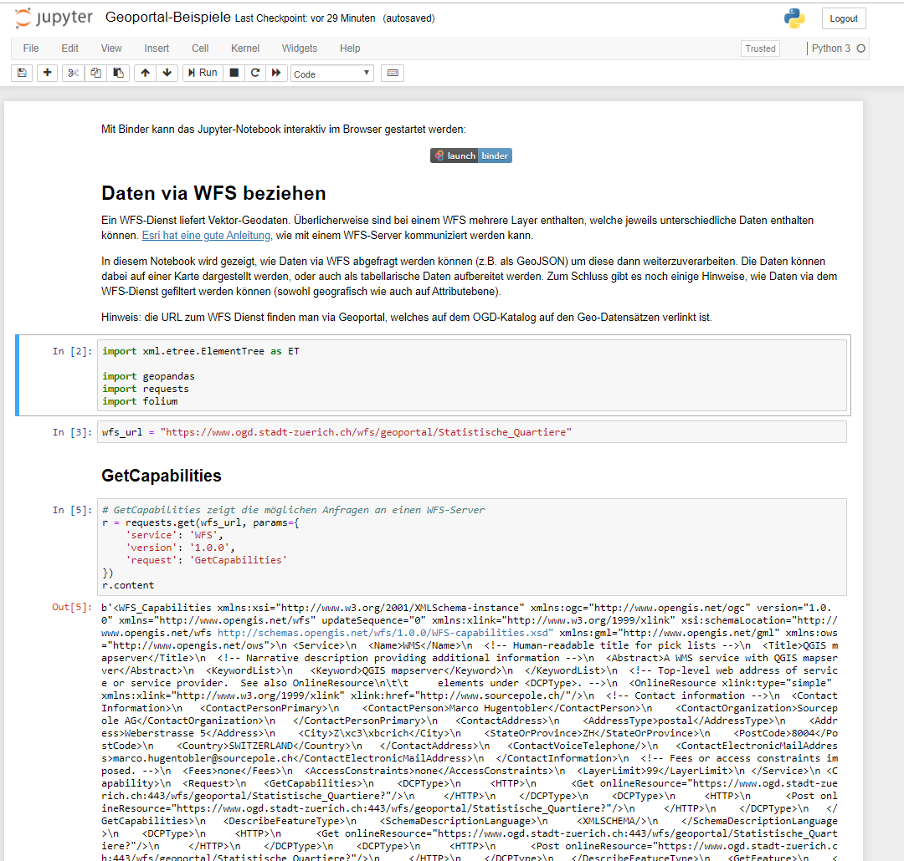

# Geoportal

Diese Dokumentation beschreibt den Umgang mit Daten aus dem [Geoportal der Stadt Zürich](https://www.stadt-zuerich.ch/geodaten/) ohne GIS-Software.
Die Verwendung von Geodaten mit GIS-Software ist in [unserer Werkstatt](https://www.stadt-zuerich.ch/de/politik-und-verwaltung/statistik-und-daten/open-government-data/werkstatt.html) beschrieben.

Insbesondere werden via Geoportal viele Datensätze als Geo-Webservices (z.B. WMS, WFS) angeboten.
Auf dem Geoportal können die Datensätze manuell in vielen verschiedenen Formaten heruntergeladen werden (z.B. GeoJSON, GPKG, Shapefile, CSV).

**Inhaltsverzeichnis**

1. [Beispiel-Abfragen mit WFS](#beispiel-abfragen-mit-wfs)
   1. [GetCapabilities](#getcapabilities)
   2. [GetFeature](#getfeature)
2. [WMS/WMTS in Leaflet einbinden](#wmswmts-in-leaflet-einbinden)
   1. [WMS Beispiel mit LV95](#beispiel-mit-dem-wms-basiskarte-zürich-raster-grau-mit-epsg2056-lv95)
   2. [WMTS Beispiel mit LV95](#beispiel-mit-dem-wmts-basiskarte-zürich-raster-grau-mit-epsg2056-lv95)
4. [Programmier-Beispiele](#programmier-beispiele)

## Beispiel-Abfragen mit WFS

Um Daten via WFS zu beziehen, muss zuerst die WFS-URL ausfindig gemacht werden.
Dazu verwendet man am besten direkt das [Geoportal der Stadt Zürich](https://www.stadt-zuerich.ch/geodaten/).
Auf dem [OGD-Katalog](https://data.stadt-zuerich.ch/dataset) gibt es auch jeweils Verweise auf die Datensätze des Geoportals.

Wenn man einen Datensatz gefunden hat, dessen Daten man gerne verwenden möchte, findet man ganz unten auf dem Geoportal den Link zum WFS-Server:


In diesem Beispiel wird der [Datensatz "Statistische Quartiere"](https://www.stadt-zuerich.ch/geodaten/download/Statistische_Quartiere) verwendet.

Der zugehörige WFS-Link ist: [https://www.ogd.stadt-zuerich.ch/wfs/geoportal/Statistische_Quartiere](https://www.ogd.stadt-zuerich.ch/wfs/geoportal/Statistische_Quartiere)

Über [Geocat](https://www.geocat.ch/geonetwork/srv/ger/md.viewer#/full_view/fd1a94fe-4bd4-4a40-99af-8b859dfe82a7) (Link "Komplette Metadaten ansehen" auf dem Geoportal) kann man eine Beschreibung der Metadaten anschauen.
WFS liefert sogenannte Features, und die Features sind in verschiedene Typen ("Layer") gegliedert.
Auf Geocat sind alle Layer beschrieben und der passende kann gewählt werden.

In unserem Beispiel "Statistische Quartiere" gibt es folgende Layer:

* `adm_statistische_quartiere_a`
* `adm_statistische_quartiere_b_p`
* `adm_statistische_quartiere_map`
* `adm_statistische_quartiere_v`

Beim Layer `adm_statistische_quartiere_map` heisst es:

> Dieser Layer kann für Datenvisualisierungen und kartographische Darstellungen verwendet werden.

Dies scheint für Visialisierungen der geeignete Layer zu sein.

### GetCapabilities

Die ganzen Informationen zum Server liefert beim WFS der `GetCapabilities`-Aufruf:

[https://www.ogd.stadt-zuerich.ch/wfs/geoportal/Statistische_Quartiere?service=WFS&version=1.1.0&request=GetCapabilities](https://www.ogd.stadt-zuerich.ch/wfs/geoportal/Statistische_Quartiere?service=WFS&version=1.1.0&request=GetCapabilities)

Das zurückgelieferte XML beinhaltet alle wichtigen Informationen:

* Unterstützte Requests des Servers
* Projektion der Daten
* Unterstützte Dateiformate
* Unterstütze Filter

### GetFeature

Mit `GetFeature` lassen sich Daten via WFS beziehen, z.B. die Statistischen Quartiere als GeoJSON:

[https://www.ogd.stadt-zuerich.ch/wfs/geoportal/Statistische_Quartiere?service=WFS&version=1.1.0&request=GetFeature&typename=adm_statistische_quartiere_map&outputFormat=GeoJSON](https://www.ogd.stadt-zuerich.ch/wfs/geoportal/Statistische_Quartiere?service=WFS&version=1.1.0&request=GetFeature&typename=adm_statistische_quartiere_map&outputFormat=GeoJSON)

## WMS/WMTS in Leaflet einbinden

Hier soll beispielhaft gezeigt werden, wie die angebotenen WMS oder WMTS sich in [Leaflet](https://leafletjs.com/) integrieren lassen.

Komplette, lauffähige Beispiele sind hier verfügbar:
- [WMS in Leaflet](https://opendatazurich.github.io/geoportal/wms_leaflet.html)
- [WMTS in Leaflet](https://opendatazurich.github.io/geoportal/wmts_leaflet.html)

In Leaflet kann grundsätzlich mit der Funktion `L.tileLayer.wms` ein WMS eingebunden werden:

```javascript
var map = L.map('mapid').setView([47.36, 8.53], 13);
L.tileLayer.wms('https://www.ogd.stadt-zuerich.ch/wms/geoportal/Basiskarte_Zuerich_Raster_Grau', {
   layers: 'wmslayers'
}).addTo(map);
```

**ACHTUNG**: Dies funktioniert, hat aber den Nachteil, dass die Daten vom WMS reprojeziert werden müssen, da die städischen WMS EPSG:2056 (LV95) nutzen. Standardmässig ist LV95 von Leaflet **nicht** unterstützt. **Durch das reprojezieren ist die Qualität der Tiles deutlich reduziert.**

## Beispiel mit dem WMS [Basiskarte Zürich Raster Grau](https://www.stadt-zuerich.ch/geodaten/download/Basiskarte_Zuerich_Raster_Grau) mit EPSG:2056 (LV95)

Um direkt die Tiles in EPSG:2056 vom WMS nutzen zu können, muss Leaflet erweitert werden. Dazu werden die beiden Module [`proj4js`](http://proj4js.org/) und [`proj4leaflet`](http://kartena.github.io/Proj4Leaflet/) benötigt.

--> [**Komplettes Beispiel WMS in Leaflet**](https://opendatazurich.github.io/geoportal/wms_leaflet.html) ([_Quellcode_](https://github.com/opendatazurich/opendatazurich.github.io/blob/master/geoportal/wms_leaflet.html))

```html
<!DOCTYPE html>
<html>
   ...
   
   <div id="mapid" style="width: 1200px; height: 800px; max-width: 100%;"></div>
   
   <script>
    // Definiere LV95
    var lv95 = {
        epsg: 'EPSG:2056',
        def: '+proj=somerc +lat_0=46.95240555555556 +lon_0=7.439583333333333 +k_0=1 +x_0=2600000 +y_0=1200000 +ellps=bessel +towgs84=674.374,15.056,405.346,0,0,0,0 +units=m +no_defs',
        resolutions: [ 4000, 3750, 3500, 3250, 3000, 2750, 2500, 2250, 2000, 1750, 1500, 1250, 1000, 750, 650, 500, 250, 100, 50, 20, 10, 5, 2.5, 2, 1.5, 1,0.5,0.2,0.1],
        origin: [2420000, 1350000]
   };
   var crs = new L.Proj.CRS(lv95.epsg, lv95.def, { 
       resolutions: lv95.resolutions, 
       origin: lv95.origin
   });
   var map = new L.Map('mapid', {
       crs: crs,
       maxZoom: crs.options.resolutions.length,
       minZoom: 16,
   }).setView([47.365, 8.54], 22);
	
   L.tileLayer.wms('https://www.ogd.stadt-zuerich.ch/wms/geoportal/Basiskarte_Zuerich_Raster_Grau', {
      layers: ['wmslayers'],
      maxZoom: crs.options.resolutions.length,
      minZoom: 0
   }).addTo(map);
   </script>
   ...
</html>
```

## Beispiel mit dem WMTS [Basiskarte Zürich Raster Grau](https://www.stadt-zuerich.ch/geodaten/download/Basiskarte_Zuerich_Raster_Grau) mit EPSG:2056 (LV95)

Um direkt die Tiles in EPSG:2056 vom WMTS nutzen zu können, muss Leaflet erweitert werden. Dazu werden die beiden Module [`proj4js`](http://proj4js.org/) und [`proj4leaflet`](http://kartena.github.io/Proj4Leaflet/) benötigt.

--> [**Komplettes Beispiel WMTS in Leaflet**](https://opendatazurich.github.io/geoportal/wmts_leaflet.html) ([_Quellcode_](https://github.com/opendatazurich/opendatazurich.github.io/blob/master/geoportal/wmts_leaflet.html))

```html
<!DOCTYPE html>
<html>
   ...
   
   <div id="mapid" style="width: 1200px; height: 800px; max-width: 100%;"></div>
   
   <script>
   // Definiere LV95
   var lv95 = {
       epsg: 'EPSG:2056',
       def: '+proj=somerc +lat_0=46.95240555555556 +lon_0=7.439583333333333 +k_0=1 +x_0=2600000 +y_0=1200000 +ellps=bessel +towgs84=674.374,15.056,405.346,0,0,0,0 +units=m +no_defs',
       resolutions: [67.7333333333, 33.8666666667, 16.9333333333, 8.4666666667, 4.2333333333, 2.1166666667, 1.0583333333, 0.5291666667, 0.2645833333, 0.1322916667, 0.0661458333],
       origin: [2480237.0, 1315832.0],
       bounds:  L.bounds( [2480237.000000, 1062032.000000], [2846837.000000, 1315832.000000])
   }
   var crs = new L.Proj.CRS(lv95.epsg, lv95.def, { 
       resolutions: lv95.resolutions, 
       origin: lv95.origin
   });
   var map = new L.Map('mapid', {
       crs: crs,
       maxZoom: crs.options.resolutions.length,
   }).setView([47.365, 8.54], 4);
	
   L.tileLayer('https://www.ogd.stadt-zuerich.ch/mapproxy/wmts/1.0.0/Basiskarte_Zuerich_Raster_Grau/default/ktzh/{z}/{y}/{x}.png', {
      maxZoom: crs.options.resolutions.length,
      tileSize: 512
   }).addTo(map);
   </script>
   ...
</html>
```

## Programmier-Beispiele

[](https://github.com/opendatazurich/opendatazurich.github.io/blob/master/geoportal/Geoportal-Beispiele.ipynb)

Im [Jupyter-Notebook Geoportal-Beispiele.ipynb](https://github.com/opendatazurich/opendatazurich.github.io/blob/master/geoportal/Geoportal-Beispiele.ipynb) sind einige Python-Beispiele gezeigt, u.a. wie Daten via WFS bezogen werden können oder eine Karte via WMS angezeigt werden kann

Jupyter-Notebook interaktiv im Browser starten:
[](https://mybinder.org/v2/gh/opendatazurich/opendatazurich.github.io/master?filepath=geoportal/Geoportal-Beispiele.ipynb)
[](https://colab.research.google.com/github/opendatazurich/opendatazurich.github.io/blob/master/geoportal/Geoportal-Beispiele.ipynb)
