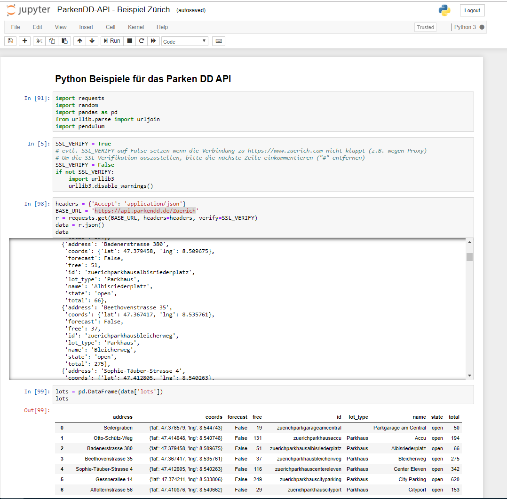

# ParkenDD

Diese Dokumentation beschreibt die Programmierschnittstelle (API) von ParkenDD.

ParkenDD ist eine App, welche basierend auf dem [Parkleitsystem der Stadt Zürich](https://www.pls-zh.ch/) die Anzahl freien Parkplätze in Parkhäusern anzeigt.
Die App gibt es für verschiedene Städte, in Zürich basiert sie auf dem Open Data Datensatz ["Parkleitsystem: Echtzeitinformation zu freien Parkplätzen in verschiedenen Parkhäusern"](https://data.stadt-zuerich.ch/dataset/parkleitsystem).

[ParkenDD stellt ein eigenes API zur Verfügung](https://api.parkendd.de/), über welches die historisierten Daten des Parkleitsystems abgerufen werden können.


**Inhaltsverzeichnis**

1. [Beispiel-Abfragen](#beispiel-abfragen)
2. [Programmier-Beispiele](#programmier-beispiele)

## Beispiel-Abfragen

Unter [https://api.parkendd.de/Zuerich](https://api.parkendd.de/Zuerich) befinden sich alle Parkhäuser (`lots`):

```
{
    "last_downloaded": "2019-11-18T15:55:02",
    "last_updated": "2019-11-18T15:51:27",
    "lots": [
        {
            "address": "Seilergraben",
            "coords": {
                "lat": 47.376579,
                "lng": 8.544743
            },
            "forecast": false,
            "free": 6,
            "id": "zuerichparkgarageamcentral",
            "lot_type": "",
            "name": "Parkgarage am Central",
            "state": "open",
            "total": 50
        },
        {
            "address": "Otto-Schütz-Weg",
            "coords": {
                "lat": 47.414848,
                "lng": 8.540748
            },
            "forecast": false,
            "free": 131,
            "id": "zuerichparkhausaccu",
            "lot_type": "Parkhaus",
            "name": "Accu",
            "state": "open",
            "total": 194
        },
        {
            "address": "Badenerstrasse 380",
            "coords": {
                "lat": 47.379458,
                "lng": 8.509675
            },
            "forecast": false,
            "free": 62,
            "id": "zuerichparkhausalbisriederplatz",
            "lot_type": "Parkhaus",
            "name": "Albisriederplatz",
            "state": "open",
            "total": 66
        },
        ...
    ]
}
```

Es lassen sich jeweils 7 Tage pro Requests abfragen, Beispiel alle Werte des Parkhaus Albisriederplatz vom 24.9.-30.9.2024:

[https://api.parkendd.de/Zuerich/zuerichparkhausalbisriederplatz/timespan?version=1.1&from=2024-09-23T23:59:59&to=2024-09-30T23:59:59](https://api.parkendd.de/Zuerich/zuerichparkhausalbisriederplatz/timespan?version=1.1&from=2024-09-23T23:59:59&to=2024-09-30T23:59:59)

```
{
    "data": [
        {
            "free": 62,
            "timestamp": "2024-09-24T00:05:08"
        },
        {
            "free": 62,
            "timestamp": "2024-09-24T00:10:03"
        },
        {
            "free": 62,
            "timestamp": "2024-09-24T00:45:03"
        },
        {
            "free": 62,
            "timestamp": "2024-09-24T00:55:08"
        },
        {
            "free": 62,
            "timestamp": "2024-09-24T01:10:08"
        },
        {
            "free": 62,
            "timestamp": "2024-09-24T01:20:08"
        },
        {
            "free": 62,
            "timestamp": "2024-09-24T01:25:03"
        },
        {
            "free": 62,
            "timestamp": "2024-09-24T01:30:03"
        },
        {
            "free": 62,
            "timestamp": "2024-09-24T01:35:03"
        },
        ...
    ]
}
```

## Programmier-Beispiele

[](https://github.com/opendatazurich/opendatazurich.github.io/blob/master/parkendd-api/ParkenDD-Beispiel.ipynb)

Im [Jupyter-Notebook ParkenDD-Beispiel](https://github.com/opendatazurich/opendatazurich.github.io/blob/master/parkendd-api/ParkenDD-Beispiel.ipynb) sind einige Python-Beispiele gezeigt, u.a. wie Daten via API bezogen werden können.

Jupyter-Notebook interaktiv im Browser starten:

[](https://mybinder.org/v2/gh/opendatazurich/opendatazurich.github.io/master?filepath=parkendd-api/ParkenDD-Beispiel.ipynb)

[](https://colab.research.google.com/github/opendatazurich/opendatazurich.github.io/blob/master/parkendd-api/ParkenDD-Beispiel.ipynb)

