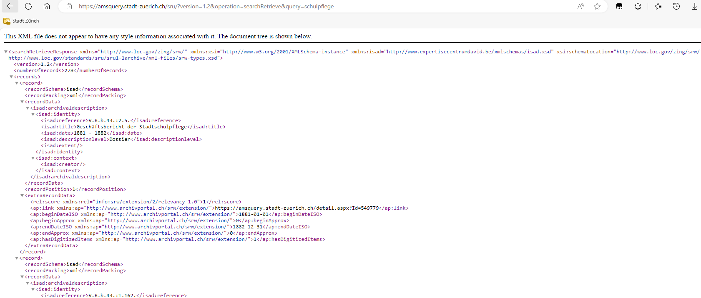

# SRU Schnittstelle zum Online Archivkatalog des Stadtarchivs Zürich

## 1. Einleitung

Willkommen zur Anleitung für die Benutzung der SRU-Schnittstelle des Online Archivkatalogs des Stadtarchivs Zürich. Diese Anleitung soll Ihnen helfen, die vielfältigen Möglichkeiten der SRU-Schnittstelle zu verstehen und effektiv zu nutzen.

Der Online Archivkatalog des Stadtarchivs Zürich, erreichbar unter [https://amsquery.stadt-zuerich.ch/](https://amsquery.stadt-zuerich.ch/), bietet eine umfangreiche Sammlung historischer Dokumente und Daten. Mit der SRU-Schnittstelle können Sie gezielt nach Informationen suchen und diese effizient abrufen.

Diese Anleitung richtet sich an Archivarinnen und Archivare, Forschende und alle, die mit dem Archivkatalog arbeiten möchten. Sie bietet sowohl eine Einführung in die grundlegenden Funktionen als auch detaillierte Anleitungen für fortgeschrittene Abfragen und die Fehlerbehebung.

Wir hoffen, dass diese Anleitung Ihnen dabei hilft, das volle Potenzial der SRU-Schnittstelle auszuschöpfen und Ihre Arbeit mit dem Online Archivkatalog des Stadtarchivs Zürich zu erleichtern.

## 2. Was ist SRU?

### Definition und Bedeutung

SRU (Search/Retrieve via URL) ist ein standardisiertes Protokoll, das es ermöglicht, über das Internet auf Datenbanken zuzugreifen und gezielte Suchanfragen zu stellen. Es basiert auf XML und HTTP und bietet eine flexible und effiziente Methode, um Informationen aus verschiedenen Quellen abzurufen. Weitere Informationen finden Sie auf [Wikipedia](https://de.wikipedia.org/wiki/Search/Retrieve_via_URL) oder der offiziellen [Dokumentation](https://www.loc.gov/standards/sru/sru-2-0.html).

### Anwendungsbeispiele

Die SRU-Schnittstelle wird in vielen Bereichen eingesetzt, um den Zugriff auf umfangreiche Datenbestände zu erleichtern. Im Kontext des Stadtarchivs Zürich ermöglicht SRU den Nutzern, spezifische historische Dokumente und Datensätze schnell und präzise zu finden. Forscher können beispielsweise gezielte Abfragen durchführen, um relevante Archivmaterialien für ihre Studien zu identifizieren, während Archivare die Schnittstelle nutzen können, um den Katalog effizient zu durchsuchen und zu verwalten.

## 3. Voraussetzungen

- **Technische Anforderungen**: Webbrowser (z.B. [Firefox](https://www.mozilla.org/de/firefox/), [Chrome](https://www.google.com/intl/de/chrome/), [Edge](https://www.microsoft.com/de-de/edge/), etc.). Für komplexere, bzw. automatisierte Abfragen kann die Installation einer Programmiersprache hilfreich sein (in dieser Anleitung wird [Python](https://www.python.org/) verwendet).
- **Zugangsdaten**: Werden nicht benötigt. Die Schnittstelle ist offen zugänglich.

## 4. Erste Schritte

### Grundlegende Abfragen

Über die Webseite [https://amsquery.stadt-zuerich.ch/](https://amsquery.stadt-zuerich.ch/) können Sie verschiedene Suchanfragen direkt im Browser erledigen. Über die [Arichivplansuche](https://amsquery.stadt-zuerich.ch/archivplansuche.aspx) können Sie in einer Baumdarstellung durch die Hierarchie der Ablage klicken. Mit der Volltext, Feld- und Deskriptorensuche können auch komplexere Suchen, die bestimmte Parameter und Filter kombinieren, realisiert werden. Alle diese Suchfunktionalitäten können auch direkt über die SRU Schnittstelle angesteuert werden.

Um die SRU-Schnittstelle des Online Archivkatalogs des Stadtarchivs Zürich zu nutzen, müssen Sie zunächst eine Verbindung herstellen. Folgen Sie diesen Schritten:

**URL aufrufen**: Öffnen Sie Ihren Webbrowser und geben Sie die URL der SRU-Schnittstelle ein: `https://amsquery.stadt-zuerich.ch/sru`.

**Parameter festlegen**: Definieren Sie die notwendigen Parameter für Ihre Abfrage. Ein einfaches Beispiel könnte wie folgt aussehen:

```plaintext
   https://amsquery.stadt-zuerich.ch/sru?version=1.2&operation=searchRetrieve&query=schulpflege
```

**Abfrage senden**: Drücken Sie die Eingabetaste, um die Abfrage zu senden. Sie erhalten eine XML-Antwort mit den Suchergebnissen:



Hier sind einige einfache Beispielabfragen, um Ihnen den Einstieg zu erleichtern:

**Suche nach einem bestimmten Begriff**:

```plaintext
   https://amsquery.stadt-zuerich.ch/sru?version=1.2&operation=searchRetrieve&query=Zürich
```

   Diese Abfrage sucht nach allen Einträgen, die den Begriff "Zürich" enthalten.

**Suche nach einem bestimmten Titel**:

```plaintext
   https://amsquery.stadt-zuerich.ch/sru/?version=1.2&operation=searchRetrieve&query=isad.title=Kindergarten
```

   Diese Abfrage sucht nach Einträgen, die den Begriff "Kindergarten" im Titel enthalten.

**Suche nach einem bestimmten Zeitpunkt**:

```plaintext
   https://amsquery.stadt-zuerich.ch/sru?version=1.2&operation=searchRetrieve&query=isad.date==1900-01-01
```

   Diese Abfrage sucht nach Einträgen, die am 1. Januar 1900 beginnen.

Diese grundlegenden Abfragen sollten Ihnen helfen, sich mit der Funktionsweise der SRU-Schnittstelle vertraut zu machen. Details zu Filtern und Parameteroptionen finden Sie im nächsten Kapitel.

Bitte beachten Sie, dass die Schnittstelle **maximal 1500** Ergebnisse (records) zurückgeben kann. Falls es für eine Anfrage mehr Treffer geben sollte, werden nur die ersten 1500 angezeigt.

### Filter und Parameter

Um Ihre Abfragen weiter zu verfeinern, können Sie verschiedene Filter und Parameter verwenden.

Unterstützte [ISAD(G)](https://de.wikipedia.org/wiki/ISAD(G))-Felder sind:

* `isad.title`: Titel (Textfeld)
* `isad.date`: Entstehungszeitraum (Datumsfeld)
* `isad.reference`: Signatur (Textfeld)
* `isad.descriptionlevel`: Stufe (Textfeld)

Verschiedene Suchkriterien können **verknüpft** werden. Zur Zeit werden diese Operatoren untersützt:

- `AND`

__Nicht__ unterstützt werden:

- `OR`
- `NOT`

Bei der **Volltextsuche** werden folgende Vergleichsoperatoren untersützt:

- `=`, `==`,  `exact`, `equal`, `adj`: sind synonym und entsprechen der Volltextsuche "mit der genauen Wortgruppe"
- `any`: entspricht der Volltextsuche mit "mit irgendeinem der Wörter"
- `all`: entspricht der Volltextsuche mit "mit allen Wörtern"

Bei der **Textfeldsuche** werden folgende Vergleichsoperatoren unterstützt:

- `=` entspricht der Feldsuche mit Operator "enthält"
- `==`,  `exact`: sind synonym und entsprechen der Feldsuche mit Operator "beginnt mit"

Bei der **Datumssuche** werden folgende Vergleichsoperatoren unterstützt:

- `=`, `within` und `encloses`: sind synonym und benötigen zwei Datumsangaben
- `==` und `exact`: sind synonym und benötigen eine Datumsangabe

## 5. Erweiterte Nutzung

### Komplexe Abfragen

Mit der SRU-Schnittstelle können Sie auch komplexere Abfragen durchführen, um spezifischere und detailliertere Ergebnisse zu erhalten. Hier sind einige Beispiele:

**Suche nach mehreren Kriterien**:

```plaintext
   https://amsquery.stadt-zuerich.ch/sru?version=1.2&operation=searchRetrieve&query=isad.title=Zürich AND isad.date==1900-01-01
```

   Diese Abfrage sucht nach Einträgen, die den Titel “Zürich” enthalten und am 1. Januar 1900 erstellt wurden.

**Suche nach einer bestimmten Signatur**:

```plaintext
   https://amsquery.stadt-zuerich.ch/SRU/?operation=searchretrieve&version=1.2&query=isad.reference=="V.F.a.38."
```

   Diese Abfrage sucht nach Einträgen, deren Signatur mit "V.F.a.38." beginnt.

**Suche nach Dokumenten einer bestimmten Stufe**:

```plaintext
   https://amsquery.stadt-zuerich.ch/SRU/?operation=searchretrieve&version=1.2&query=isad.descriptionlevel="dossier" and isad.title="Feuerpolizei"
```

   Diese Abfrage sucht nach Einträgen von der Stufe "Dossier", die "Feuerpolizei" im Titel haben.

**Suche mit Bereichsangaben**:

```plaintext
   https://amsquery.stadt-zuerich.ch/SRU/?operation=searchretrieve&version=1.2&query=ISAD.Date within "1920 1925"
```

   Diese Abfrage sucht nach Einträgen, die zwischen dem 1. Januar 1920 und dem 31. Dezember 1925 erstellt wurden.

Weitere Beispiele mit komplexen Abfragen finden Sie auch im Anhang weiter unten.

### Automatisierte Abfragen mit Python

Möchten Sie viele verschiedene Abfragen machen oder Abfragen zu bestimmten Zeitpunkten wiederholen, kann es sinnvoll sein den Ablauf zu automatisieren. Das kann mit einer Vielzahl von Programmierwerkzeugen erledigt werden. Hier ein Beispiel mit der Programmiersprache Python. Um diese zu benutzen müssen Sie Python zuvor installieren. Mehr Informationen dazu finden Sie hier: [https://www.python.org/about/gettingstarted/](https://www.python.org/about/gettingstarted/).

#### sruthi

Da es sich bei SRU um ein XML-basiertes Protokoll handelt, gibt es dazu die Hilfsbiliothek [sruthi](https://github.com/metaodi/sruthi), die dabei hilft die Anfragen zu formulieren und die Antworten für Python nutzbar zu machen. Sruthi lässt sich einfach über die Kommandozeile installieren:

```shell
pip install sruthi
```

Abfragen können Sie so absetzen:

```python
>>> import sruthi
>>> records = sruthi.searchretrieve(
...     'https://amsquery.stadt-zuerich.ch/SRU/',
...     query="isad.reference = V.B.b.43.:1 AND isad.descriptionlevel = Dossier"
... )
>>> print(records)
SearchRetrieveResponse(sru_version='1.2',count=165,next_start_record=11)
>>> print(records[0]) # zeige ersten record
{'schema': 'isad', 'reference': 'V.B.b.43.:1.1.', 'title': 'Geschäftsbericht des Stadtrats', 'date': '1859', 'descriptionlevel': 'Dossier', 'extent': None, 'creator': None, 'extra': {'score': '1', 'link': 'https://amsquery.stadt-zuerich.ch/detail.aspx?Id=549636', 'beginDateISO': '1859-01-01', 'beginApprox': '0', 'endDateISO': '1859-12-31', 'endApprox': '0', 'hasDigitizedItems': '1'}}
```

Das Ergebnis ist ein iterierbares Python-Objekt. Sie können sich einzelne Einträge heraussuchen (z.B. `records[0]` für den ersten Eintrag, oder `records[:5]` für die ersten 5 Einträge). Oder das komplette Objekt in der Schleife durchgehen und z.B. alle Einträge in einer Tabelle als CSV speichern:

```python
import sruthi
import csv
import sys
 
# Abfrage der SRU Schnittstelle
records = sruthi.searchretrieve(
    'https://amsquery.stadt-zuerich.ch/SRU/',
    query="isad.reference = V.B.b.43.:1 AND isad.descriptionlevel = Dossier"
)

# Erstelle CSV Writer 
header = ['signatur', 'titel', 'jahr', 'link_query']
writer = csv.DictWriter(
    sys.stdout, # hier Dateinamen einfügen (sonst wird Ergebnis im Ausgabefenster angezeigt)
    header,
    delimiter=',',
    quotechar='"',
    lineterminator='\n',
    quoting=csv.QUOTE_MINIMAL
)
writer.writeheader()

# Schleife über alle Einträge
for record in records:
    row = {
       'signatur': record['reference'],
       'titel': record['title'],
       'jahr': record['date'],
       'link_query': record['extra']['link'],
    }
    writer.writerow(row)
```

Sruthi bietet noch eine Vielzahl weiterer Funktionalität. Weitere Beispiele finden Sie auch auf der [Githubseite](https://github.com/metaodi/sruthi) des Projektes.

## 6. Fehlerbehebung

### Häufige Probleme

1. **Keine Verbindung zur SRU-Schnittstelle**
   * **Problem**: Sie können keine Verbindung zur SRU-Schnittstelle herstellen.
   * **Lösung**: Überprüfen Sie Ihre Internetverbindung und stellen Sie sicher, dass die URL korrekt eingegeben wurde.
2. **Ungültige Abfrageparameter**
   * **Problem**: Ihre Abfrage liefert keine Ergebnisse oder eine Fehlermeldung.
   * **Lösung**: Überprüfen Sie die Syntax Ihrer Abfrage und stellen Sie sicher, dass alle Parameter korrekt sind. Konsultieren Sie diese Anleitung für die richtige Verwendung der Parameter.
3. **Leere Suchergebnisse**
   * **Problem**: Ihre Abfrage liefert keine Treffer, obwohl Sie sicher sind, dass Daten vorhanden sein sollten.
   * **Lösung**: Überprüfen Sie die Suchkriterien und stellen Sie sicher, dass sie korrekt und spezifisch genug sind. Versuchen Sie, die Abfrage zu verfeinern oder andere Suchbegriffe zu verwenden.
4. **Langsame Antwortzeiten**
   * **Problem**: Die SRU-Schnittstelle reagiert sehr langsam.
   * **Lösung**: Dies kann an einer hohen Serverauslastung liegen. Versuchen Sie es zu einem späteren Zeitpunkt erneut.
5. **Es werden nicht alle Einträge angezeigt**
   * **Problem**: Es werden pro Abfrage maximal 1500 Einträge zurückgegeben, auch wenn die es mehr Treffer gäbe.
   * **Lösung**: Wählen Sie ihre Abfragekriterien, z.B. durch Kombination mehrerer Kriterien so, dass maximal 1500 Ttreffer gefunden werden können.

## 7. Best Practices

### Effiziente Nutzung

Um die SRU-Schnittstelle des Online Archivkatalogs des Stadtarchivs Zürich optimal zu nutzen, beachten Sie die folgenden Tipps:

1. **Verwenden Sie spezifische Suchbegriffe** : Je genauer Ihre Suchbegriffe sind, desto relevanter werden die Ergebnisse sein. Vermeiden Sie allgemeine Begriffe und nutzen Sie spezifische Namen, Daten oder Schlagwörter.
2. **Kombinieren Sie Parameter** : Nutzen Sie die Möglichkeit, mehrere Parameter zu kombinieren, um präzisere Ergebnisse zu erhalten. Zum Beispiel können Sie nach einem bestimmten Autor und einem bestimmten Zeitraum gleichzeitig suchen.
3. **Überprüfen Sie regelmäßig die Dokumentation** : Die SRU-Schnittstelle kann aktualisiert werden. Stellen Sie sicher, dass Sie immer die aktuelle [Dokumentation](https://www.loc.gov/standards/sru/sru-2-0.html) zur Hand haben, um neue Funktionen und Änderungen zu nutzen.

## 8. Anhang

### Beispielabfragen:

Basisabfrage

```
https://amsquery.stadt-zuerich.ch/SRU/?operation=searchretrieve&version=1.2&query=
```

Signatur (isad.reference) entspricht: "V.E.c.72.:1.2.1."

```
https://amsquery.stadt-zuerich.ch/SRU/?operation=searchretrieve&version=1.2&query=isad.reference=="V.E.c.72.:1.2.1."
```

Signatur entspricht: "V.E.c.72.:1.2.1." und Titel ist "Tram"

```
https://amsquery.stadt-zuerich.ch/SRU/?operation=searchretrieve&version=1.2&query=isad.reference%20==%22V.E.c.72.:1.2.1.%22%20AND%20ISAD.TITLE==%22Tram%22
```

Signatur entspricht: "V.E.c.72.:1.2.1." und Titel ist "Tram" und Datum ist 1920

```
https://amsquery.stadt-zuerich.ch/SRU/?operation=searchretrieve&version=1.2&query=isad.reference%20==%22V.E.c.72.:1.2.1.%22%20AND%20ISAD.TITLE==%22Tram%22%20AND%20ISAD.Date==%221920%22
```

Signatur entspricht: "V.E.c.72.:1.2.1." und Titel ist "Tram" und Datum ist zwischen 1920 und 1925

```
https://amsquery.stadt-zuerich.ch/SRU/?operation=searchretrieve&version=1.2&query=isad.reference%20=="V.E.c.72.:1.2.1."%20AND%20ISAD.TITLE=="Tram"%20AND%20ISAD.Date within "1920 1925"
```

Volltextsuche auf der Detailseite

```
https://amsquery.stadt-zuerich.ch/SRU/?operation=searchretrieve&version=1.2&query=Serverchoice%20all%20%22tram%22%20AND%20ISAD.REFERENCE==%22V.E.c.72.:1.2.1%22%20AND%20isad.date%20WITHIN%20%221920%201932%22%20and%20serverchoice%20all%20%22schwarz-weiss%20Karton%22
```

Alle records welche mit der Signatur "VII.6." beginnen:

```
https://amsquery.stadt-zuerich.ch/SRU/?operation=searchretrieve&version=1.2&query=isad.reference%20==%20%22VII.6.%22
```

Alle records welche mit der Signatur "VII.6." beginnen und Stufe "Dossier" sind:

```
https://amsquery.stadt-zuerich.ch/SRU/?operation=searchretrieve&version=1.2&query=isad.reference%20==%20%22VII.6.%22%20and%20isad.descriptionlevel%20=%20%22dossier%22
```

Alle records welche mit der Signatur "VII." beginnen und im Volltext "theater" oder "griechen" vorkommt:

```
https://amsquery.stadt-zuerich.ch/SRU/?operation=searchretrieve&version=1.2&query=SERVERCHOICE%20any%20%22theater%20griechen%22%20and%20isad.reference%20==%20%22VII.%22
```

Alle records welche mit der Signatur "VII." beginnen, Stufe "Dossier" sind und der Zeitraum 1950 ist:

```
https://amsquery.stadt-zuerich.ch/SRU/?operation=searchretrieve&version=1.2&query=isad.reference%20==%20%22VII.%22%20and%20isad.descriptionlevel%20=%20%22dossier%22%20and%20isad.date%20within%20%221950-01-01%201950-12-31%22
```

### Ressourcen:

- [Online Archivkatalog des Stadtarchivs Zürich](https://amsquery.stadt-zuerich.ch/suchinfo.aspx)
- [Wikipediaseite zu SRU](https://de.wikipedia.org/wiki/Search/Retrieve_via_URL)
- [SRU Dokumentation](https://www.loc.gov/standards/sru/sru-2-0.html)

## 9. Schlusswort

### Zusammenfassung

In dieser Anleitung haben wir die grundlegenden und erweiterten Funktionen der SRU-Schnittstelle des Online Archivkatalogs des Stadtarchivs Zürich behandelt. Sie haben gelernt, wie Sie einfache und komplexe Abfragen durchführen, verschiedene Filter und Parameter nutzen und häufige Probleme beheben können. Mit diesen Kenntnissen sind Sie nun in der Lage, die SRU-Schnittstelle effizient zu nutzen und gezielt nach historischen Dokumenten und Daten zu suchen.

### Feedback

Wir hoffen, dass diese Anleitung Ihnen geholfen hat, die SRU-Schnittstelle besser zu verstehen und zu nutzen. Falls Sie noch Fragen zu dieser Anleitung oder zur Benutzung der Schnittstelle haben wenden Sie sich gerne an das [Open Data Team](https://www.stadt-zuerich.ch/portal/de/index/ogd/kontakt.html). Bei inhaltlichen Fragen steht Ihnen das Team des [Stadtarchivs](https://www.stadt-zuerich.ch/content/prd/de/index/stadtarchiv/ueber_uns/kontakt.html) zur Verfügung.
